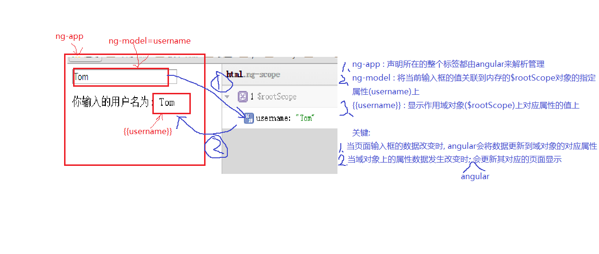
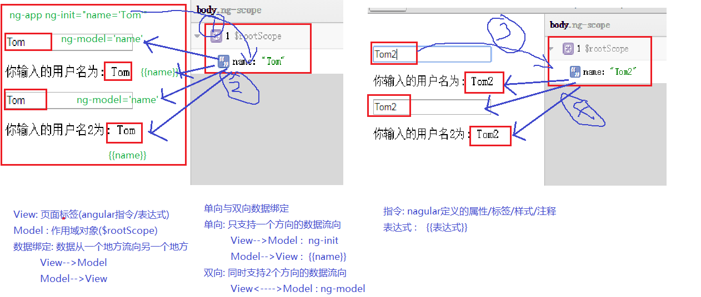

## AngularJS 概念

Google开源的 前端JS 结构化 框架
动态展示页面数据, 并与用户进行交互

### AngularJS特性(优点)

* 双向数据绑定
* 声明式依赖注入
* 解耦应用逻辑, 数据模型和视图
* 完善的页面指令
* 定制表单验证
* Ajax封装

`angualr`就是通过声明式依赖注入， 来得到作用域对象 ，形参名不能随便定义（只是针对当前这种写法）

### MVC模式

- **M: Model, 即模型**

  - 在`angular`中： 为`scope`
  - 储存数据的容器
  - 提供操作数据的方法

- **V: View, 即视图**

  - 在`angular`中：为页面
  - 包括: `html/css/directive/expression`
  - 显示Model的数据
  - 将数据同步到Model
  - 与用户交互

  **C: Controller, 即控制器**

  - 在angular中：为`angular`的`Controller`
  - 初始化`Model`数据
  - 为`Model`添加行为方法

### MVVM模式

  * **M: Model, 即数据模型,** 
      * 在angular中：为scope中的各个数据对象
  * **V: View, 即视图,** 
      * 在angular中：为页面
  * **VM: ViewModel, 即视图模型,** 
      * 在angular中：为scope对象

在angular中controller不再是架构的核心，在MVVM中只是起辅助作用，用来辅助$scope对象，即VM层

## AngularJS基本操作

### ng-app（指令）

告诉angular核心它管理当前标签所包含的整个区域,并且会自动创建$rootScope根作用域对象

~~~html
<body ng-app>
</body>
~~~

###   ng-model（指令）

将当前输入框的值与谁关联(属性名:属性值), 并作为当前作用域对象($rootScope)的属性
通常表示一个完整的执行单位，一段完整的js可执行的代码，有的语句也可以用表达式来执行，叫做表达式语句。

###  大括号表达式`{{}}`

显示数据,从作用域对象的指定属性名上取

~~~html
<body ng-app>
  <input type="text" ng-model="username">
	
您输入的内容是：{{username}}

</body>
~~~

### 表达式可操作数据

基本类型数据: `number/string/boolean`
`undefined, Infinity, NaN, null`解析为空串: `"", `不显示任何效果
对象的属性或方法，以及数组

~~~html
<body ng-app="">

{{1}}

{{'尚硅谷'}}

{{undefined}}

{{'atguigu'+3}}

{{4+3}}

{{true}}

{{a+b}}

  {{p.name}}---{{p.age}}----{{arr[2]}}

~~~

表达式通常有一个返回值，可以放在任何需要值得地方，比如函数调用的参数，一个变量名，一个运算，

## 双向绑定数据

**View（视图）：** 也就是我们的页面 (主要是`Andular`指令和表达式)

**Model(模型) ：**作用域对象(当前为`$rootScope`), 它可以包含一些属性或方法

### **数据绑定**

当改变View中的数据, Model对象的对应属性也会随之改变:  ng-model指令  数据从`View-->Model`
当Model域对象的属性发生改变时, 页面对应数据随之更新:  `{{}}`表达式  数据从`Model-->View``
``ng-model`是双向数据绑定, 而`{{}}`是单向数据绑定

~~~html
<body ng-app="" ng-init="name='tom'">
<!-- ng-init  用来初始化当前作用域变量。-->
<input type="text" ng-model="name">

姓名1：{{name}}
  <!-- tom -->
<input type="text" ng-model="name">

姓名2：{{name}}
	<!-- tom -->
</body>
~~~

## 函数控制器 （v1.2）

用来控制AngularJS应用数据的 实例对象
 **ng-controller :** 指定控制器构造函数, `Angular`会自动`new`此函数创建控制器对象
同时`Angular`还有创建一个新的域对象`$scope`, 它是`$rootScope`的子对象
**形参必须是特定的名称**, 否则`Angular`无法注入抛异常

~~~html
<body ng-app="">
<!--
    * 回调函数的event的就是依赖对象
    * 回调函数有形参就是依赖注入
-->

  <input type="text" placeholder="姓" ng-model="firstName"> <!-- 小飞机 -->
  <input type="text" placeholder="名" ng-model="lastName">	<!-- 大飞机 -->
  
输入的姓名为: {{firstName+'-'+lastName}}

  
输入的姓名2为: {{getName()}}
 <!-- 小飞机 大飞机 -->

</body>
~~~

### 依赖注入

依赖的对象以形参的形式被注入进来使用，这种方式就是依赖注入。`angular`的 `$scope对象`就是依赖对象，并且是依赖注入的形式进行使用。回调函数有形参就是依赖注入

### 依赖对象

完成某个特定的功能需要某个对象才能实现，这个对象就是依赖对象。

~~~javascript
document.getElementById('btn').onclick = function(event) {
  alert(event.clientX); // clientX 必须依赖event
};
~~~

**命令式：**命令程序执行的时候每一步都是按照自己的指令，更注重执行的过程

~~~javascript
var arr = [1,2,3,4,5];
var newArr = [];
for(var i=0;i<arr.length;i++){
    var num = arr[i]*2;
    newArr.push(num);
};console.log(newArr);
~~~

**声明式：**更注重执行的结果。

~~~javascript
var newArr2 = arr.map(function (item) {
   return item*2;
});
console.log(newArr2);
~~~

## 模块控制器（v1.5）

模块间具有作用域，两个模块不会受到干扰

~~~html
<body ng-app="MyApp">
	

  	<input type="text" ng-model="empName">
  	
员工名:{{empName}}
 <!--Tom-->
	

  
	
 <!--Jack-->
  	<input type="text" ng-model="empName">
  	
员工:{{empName}}

	

</body>

~~~

### 方法链调用

~~~javascript
angular.module('MyApp',[])//模块对象的方法执行完返回的就是模块对象本身
	.controller('MyCtrl',function ($scope) {//）
		$scope.empName = 'Tom';
	}).controller('MyCtrl1',function ($scope) {
		$scope.empName = 'Jack';
	})
~~~

### $scope写法问题

`js`代码压缩时会把所有的局部变量压缩成`abcd`等

~~~javascript
angular.module('MyApp',[])
	.controller('MyCtrl',['$scope',function ($scope) {
		$scope.empName = 'Tom';
	}]).controller('MyCtrl1',['$scope',function ($scope) {
		$scope.empName = 'Jack';
	}])
~~~

## 常用Angular指令

`Angular`为`HTML`页面扩展的: 自定义标签属性或标签
与`Angular`的作用域对象`(scope)`交互,扩展页面的动态表现力

 * ng-app: 指定模块名，angular管理的区域
  * ng-model： 双向绑定，输入相关标签
  * ng-init： 初始化数据
  * ng-click： 调用作用域对象的方法（点击时）
  * ng-controller: 指定控制器构造函数名，内部会自动创建一个新的子作用域（外部的）
  * ng-bind： 解决使用`{{}}`显示数据闪屏（在很短时间内显示`{{}}`）
  * ng-repeat： 遍历数组显示数据， 数组有几个元素就会产生几个新的作用域
    * $index, $first, $last, $middle, $odd, $even
  * ng-show: 布尔类型， 如果为true才显示
  * ng-hide: 布尔类型， 如果为true就隐藏

### html元素执行ng-repeat指令遍历数组

当ng-repeat命令遍历数组时，会在当前代码作用域产生六个变量
`$index(当前索引), $first(第一个), $last(最后一个), $middle(中间的), $odd(奇数行), $even(偶数行)`

~~~html
 <ul>
 	<li ng-repeat="person in persons">
		第一个：{{$first}},第{{$index + 1}}个，
		中间的：{{$middle}},最后一个：{{$last}},
		偶数行：{{$even}},奇数行{{$odd}},
		{{person.name}}----{{person.age}}
	</li>
</ul>

~~~

### ng-bind 指令解决闪烁加载

**`ng-bind`与`{{}}`取值的区别**

-  **{{ }}** 是等页面加载完后，再取值
-  **ng-bind** 它是在页面加载的时候，是不会显示{{name}}这种变量出来
-  **ng-bind** 可以解决 ng 页面闪烁加载问题
-  **ng-bind** 只能绑定单个变量，但是 **{{ }}** 这种方法可以绑定多个变量。

~~~html

{{'asdfdsfds'}}

{{count2}}

~~~

### 条件渲染指令

**ng-show：** 布尔类型， 如果为true才显示
**ng-hide：** 布尔类型， 如果为true就隐藏

~~~html

我喜欢贾静雯
 <!--显示-->

贾静雯喜欢我
 <!--隐藏-->

~~~

**ng-class：**动态引用定义的样式  {aClass:true, bClass:false}
**ng-style：** 动态引用通过js指定的样式对象   {color:'red', background:'blue'}

~~~html

猜猜我什么颜色

猜猜我颜色是什么

~~~

### 指令调用绑定作用域对象事件

**ng-click：** 点击监听, 值为函数调用, 可以传$event

~~~html
<button ng-click="switch()">切换</button> <!--绑定点击更改isLike的值-->

我喜欢贾静雯
 <!--显示-->

贾静雯喜欢我
 <!--隐藏-->

~~~

**ng-mouseenter：** 鼠标移入监听, 值为函数调用, 可以传$event

~~~html
<button ng-click="enter()">啦啦啦</button>

~~~

**ng-mouseleave：**鼠标移出监听, 值为函数调用, 可以传$event

~~~html
<button ng-click="enter()">啦啦啦</button>

~~~
