## 双列布局

~~~html
<style>
#left{width: 200px;float: left;}
#right{background: pink;}
</style>
<div id="left">left</div>
<div id="right">right</div>
~~~

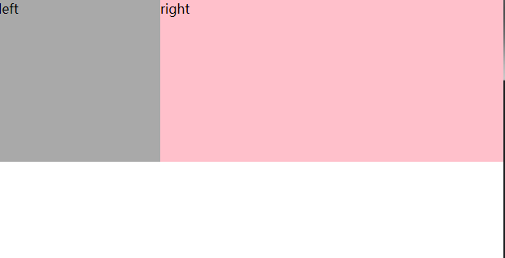

## 圣杯布局

**两侧宽度固定，中间宽度自适应的三栏布局**。

**圣杯布局特点：**中间部分在DOM结构上优先，以便先行渲染、中间部分在DOM结构上优先，以便先行渲染、允许三列中的任意一列成为最高列

### 1. DOM结构

~~~html
<div id="header"></div>
	<div id="container">
  	<div id="center"></div>
  	<div id="left"></div>
  	<div id="right"></div>
	</div>
<div id="footer"></div>
~~~

首先定义出整个布局的DOM结构，主体部分是由`container`包裹的`center`,`left`,`right`三列，其中`center`定义在最前面。

### 2. CSS代码

假设左侧的固定宽度为200px，右侧的固定宽度为150px，则首先在`container`上设置

~~~css
#container {
  padding-left: 200px; 
  padding-right: 150px;
}
#left{width: 200px;}
#right{width: 150px;}
~~~

为左右两列预留出相应的空间，得到如下示意图：

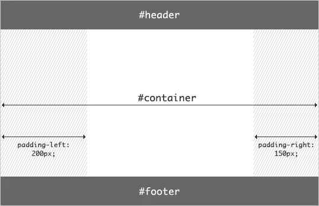

### 3. 设置浮动

~~~css
/* 为left和right和center设置浮动，更好的进行排序工作 */
#left,#right,#center{float: left;}
/* 为了让中间元素自适应，设置宽度为100% */
#center{width: 100%;}
~~~


根据浮动的特性，由于`center`的宽度为100%，即占据了第一行的所有空间，所以`left`和`right`被“挤”到了第二行。

### 4. 让左边元素到位

接下来的工作是将`left`放置到之前预留出的位置上，这里使用**[负外边距](https://www.cnblogs.com/2050/archive/2012/08/13/2636467.html)（nagetive margin）**

使用负外边距，将元素往某个方向扯，简单点说，margin是控制元素的边界

~~~css
#left{margin-left: -100%;}
~~~

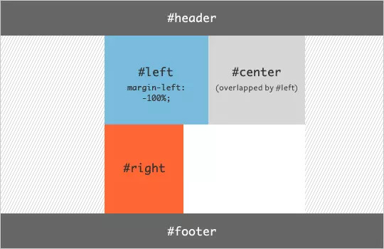

用margin负值调整#left超出父元素边界时，浮动元素边界的就会被拉回第一行
**原因：**上方#center盒子是浮动块的、所以并不是真正意义上的占据一行
			往回拉，超出父元素边界，其原理跟`cneter`腾出`left`的位置一样，只不过这种做法是强制的调整`left`的边界

**在利用相对定位，将`left`在往左边拉，跟父级元素`padding`重叠**

~~~css
#left{position: relative;left: -200px;}
~~~

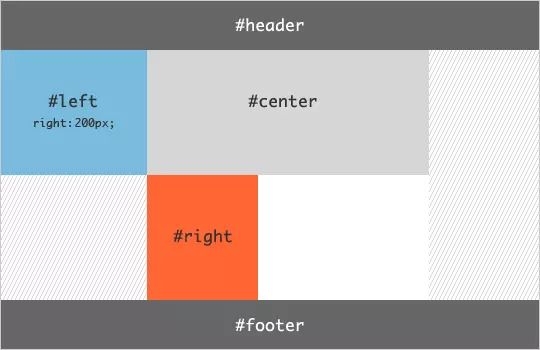

### 5. 让右边元素到位

right只要一条代码，将元素的右边界往左拉

~~~css
#right {margin-right: -150px}
~~~

如果右边的边界超出了父元素左边的边界，就会掉上去。这时候，元素的左边界就会贴着center上，可以理解为 把父元素的padding-right的尺寸给削没了。

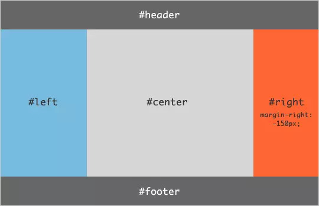

### 6. 父元素宽度限制

布局效果完成。不过还需要考虑最后一步，那就是**页面的最小宽度**：要想保证该布局效果正常显示，由于两侧都具有固定的宽度，所以需要给定页面一个最小的宽度，但这并不只是简单的200+150=350px。回想之前`left`使用了`position: relative`，所以就意味着在`center`开始的区域，还存在着一个`left`的宽度。所以页面的最小宽度应该设置为`200+150+200=550px`：

~~~css
body {min-width: 550px;}
~~~

## 伪等高布局

将三个元素的内边距调到很高的值，在利用margin将边距调回来

~~~css
#left,#right,#center{
	padding-bottom: 10000px;
	margin-bottom: -10000px;
}
~~~

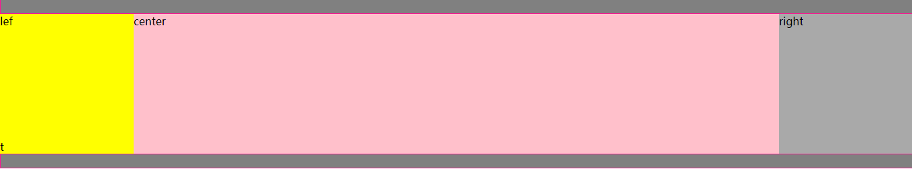

## 双飞翼布局

双飞翼布局的DOM结构与圣杯布局的区别是用`container`仅包裹住`center`，另外将`浮动元素`从`center`移至`container`上。

### 1. DOM结构

```xml
<body>
  <div id="header"></div>
  <div id="container">
    	<div id="center"></div>
  </div>
  <div id="left"></div>
  <div id="right"></div>
  <div id="footer"></div>
<body>
```

### 2. CSS代码

~~~css
/* 假设left为200，right为150 */
#container {width: 100%;}
#center{margin-left: 200px;margin-right: 150px;}
#left {width: 200px;}
#right {width: 150px;}
~~~

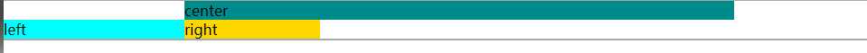

### 3. 让左边元素到位

~~~css
#left {margin-left: -100%;}
~~~

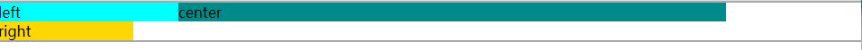

### 4. 让右边元素到位

~~~css
#right {margin-left: -150px;}
~~~

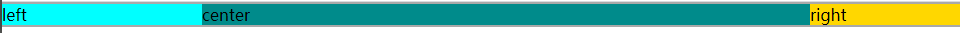

## 禁止滚动条

~~~css
html,body {height: 100%,overflow: hidden}
~~~

## fixed是relative

由于滚动条默认是给`document`，在把`html`的高度固定在视口窗，在由`body`进行滚动操作

将html的滚动条禁止，在将body 的滚动条开启，就形成一个相反的状况这时候以body为父元素的绝对定位则拖动滚动条位置也不会改变

~~~css
html{height: 100%;overflow: hidden;}
body{height: 100%;overflow: audo;}
~~~

以此推测,其实`fixed`定位也是绝对定位、他是相对于document窗口定位的

## sticky footer粘连

在正常文档流中，当内容较少时，页脚部分不会始终固定在屏幕的最下方。这时候就该让传说中的sitcky footer布局出现了。

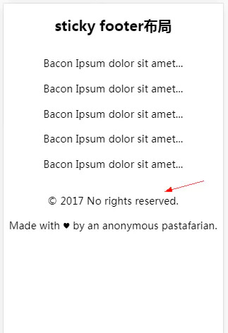

不管内容区有多少内容，页脚始终显示在屏幕的最下方，当内容区域超过屏幕的高度时。页脚会始终显示在页面的最底部。

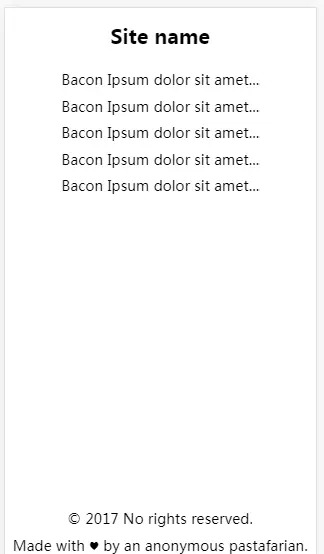

### 1. DOM结构

~~~html
<body>
	<div id="wrap">
		<div id="main">......</div>
	</div>
	<div id="footer">footer</div>
</body>
~~~

~~~css
/* 首先让父元素(body)的高度撑开屏幕 */
html,body{height: 100%;}

/* 固定内容区的高度为100% */
#warp{height: 100%; }
#footer{
	/* 固定footer的高度为200 */
	height: 100px;
	/* 由于这时内容区的高度是100%所以footer被挤下去了，但是我们可以利用margin负值来将footer拉上来 */
	margin-top: -100px;
}
~~~


## 块级格式化上下文(BFC)

### Box：CSS布局的基本单位

Box 是CSS布局的对象和基本单位，直观点来时，技术有关页面是由很多个Box组成的。

元素的类型和`display`属性，决定了这个Box的类型。不同类型的`Box`，会参与不同的`Formatting Context`（一个决定如何渲染文档的容器），因此Box内的元素会以不同的方式渲染
**block-level box：**`display`属性为`block`，`list-item`，`table`的元素，会生成`block-level-box`。并且参与Formatting Context；

**inline-level box：**`display`属性为`inline`，`inline-table`的元素，会生成block-level-box。并且参与Formatting Context；

### Formatting Context

Formatting Context是W3C CSS2.1 规范中的一个概念，他是页面中的一块渲染区域，并且有一套渲染规则，他决定了其子元素将如何定位，以及和其他元素的关系合互相作用

最常见的`Formatting Context`有**Block formatting context**（简称`BFC`）、**Inline formatting context**（简称`IFC`）

### Block formatting context

BFC（Block formatting context）直译为“块级格式化上下文”。他是一个独立的渲染区域，只有Block-level box参与，他规定了内部的Block-level Box如何布局，并与这个区域外部毫不相关

### BFC布局规则

- 内部的Box会在垂直方向，一个接一个的放置。
- BFC的区域不会与floatbox重叠。
- 内部的Box垂直方向的距离由margin决定。属于同一个BFC的两个相邻Box的margin会发送重叠
- 计算BFC的高度是，浮动元素也参与计算。（清除浮动 haslayout）
- BFC计算页面上的一个隔离的独立容器，容器里面的子元素不会影响到外面的元素。

### BFC的出现

- 根元素
- `float`属性不为`none`
- `position`为`absolute`或`fixed`
- `overflow`不为`visible`
- `display`为`inline-block,table-cell,table-caption,flex,inline-flex`

## 清除浮动

~~~css
/*由于IE6,7需要开启布局才会撑开父元素 zoom可以让父元素拥有布局*/
.clearfix{*zoom: 1;}
.clearfix:after{content: '';display: block;clear: both;}
~~~

## 行内元素排版方式

~~~css
vertical-align: top;
~~~

## 检测IE版本

~~~js
function isIE(version){
	var b = document.createElement('b');
	b.innerHTML = "<!--[if IE "+version+"]><i></i><![endif]-->"
	return b.getElementsByTagName("i").length == 1;
}
// 注 IE8以上已失效
console.log(isIE(8)||isIE(7)||isIE(6)||isIE(5));
~~~

