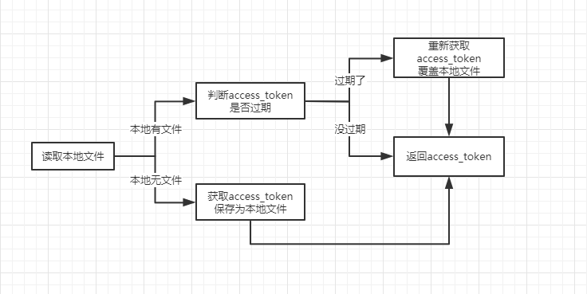
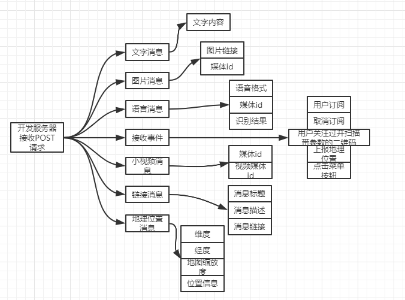

# 微信公众号

微信公众平台,是给个人、企业和组织提供业务服务与用户管理能力的全新服务平台。简单来说，一个提供服务平台。

**注册微信公众号：**https://mp.weixin.qq.com/

## 微信公众号的分类

### 订阅号

**适用主要人群：**个人、媒体。
**群发次数：**订阅号（认证用户、非认证用户）1天内可群发1条消息。
为媒体和个人提供一种新的信息传播方式，主要功能是在微信侧给用户传达资讯；（功能类似报纸杂志）

### 服务号

**适用主要人群：**企业、政府或其他组织。
**群发次数：**服务号1个月（按自然月）内可发送4条群发消息。
为企业和组织提供更强大的业务服务与用户管理能力，主要偏向服务类交互（功能类似银行，12315，114等）

### 企业微信（原企业号）

企业微信继承企业号所有能力，同时为企业提供专业的通讯工具、丰富的办公应用与API，助力企业高效沟通与办公。

## 订阅与服务号的主要区别

### 推送频率

订阅号：1天内可群发1条消息。			服务号：1个月内可发送4条群发消息。

### 提供功能

订阅号：包含大部分功能。				服务号：认证的服务号包含全部功能。

### 适用人群

订阅号：个人、媒体。				服务号：企业、政府或其他组织。

## 使用微信号

登录后，页面左边将会有一排功能选项，订阅号中一共有5个功能可以直接设置使用。

# 映射服务器架构

## 构建node.js服务器

`demo.js`

~~~js
// 引入express模块
const express = require('express')
// 创建app应用对象
const app = express()
// 添加中间件
app.use((req, res, next)=>{})
// 监听端口号
app.listen(3000, ()=> console.log('服务器启动成功'))
~~~

**命令运行服务器：**`node demo.js`

## ngrok 映射内网端口

~~~
|- 授权命令 -|
ngrok authtoken 1aHiCly2wNBjST2mtF4oJp92Zjj_3sM27HoSy4yDSUtc6tRdL
|- 运行开发端口 -|
ngrok http 3000
~~~

# 微信公众号开发设置

## 微信公众号的请求流程

## 填写服务器配置

开发/开发者工具  ==>  开发者文档  ==>  开始开发/接口测试号申请  ==>  进入微信公众帐号测试号申请系统

## 服务器接口信息配置

填写ngrok内网渗透的URL和Token提交后，微信会发送一个请求到填写的url上，服务器需要对请求处理并返回给微信才能配置成功

**微信接口配置请求参数**

~~~json
{
  signature: 'c35b593471d122b1683c1090eb4dffa3a494e14c', // 微信加密签名
  echostr: '8914314992233147389',		// 随机字符串
  timestamp: '1586400252',		// 微信发送请求时间戳
  nonce: '267878625'		// 随机数字
}
~~~

## 验证服务器请求来源

~~~
1）将timestamp、nonce、token三个参数进行字典序排序 (a b c.... 1 2 3...)
2）将三个参数字符串拼接成一个字符串进行sha1加密 
3）开发者获得加密后的字符串 与 signature(微信加密签名)对比， 标识该请求来源于微信
	 如果比较一样、说明信息来源于微信服务器，返回echostr给微信服务器
	 如果不一样，说明不是微信服务器发送的消息，返回error
~~~

**安装sha1加密：**`cnpm i sha1 --save`

~~~js
// 引入express模块
const express = require('express')
// 引入sha1加密模块
const sha1 = require('sha1')
// 创建app应用对象
const app = express()

/* 验证服务器有效性(接收处理所有参数) */
// 配置官网提供的参数
const token = 'mrMaoHTML15106'
const appID = 'wxa2a6b98bb1a339d6'
const appsecret = 'd0896af5e43a366558cb05e68f6ce7c8'
// 添加默认根路径中间件请求路由
app.use((req, res, next)=>{
    // 获取请求参数：加密签名、随机字符串、请求时间戳、随机数字
    const {signature, echostr, timestamp, nonce} = req.query
    // 进行字典排序, 并进行拼串
    const str = [timestamp, nonce, token].sort().join('')
    // 进行sha1加密
    const sha1Str = sha1(str)
    // 加密字符串进行微信服务器比较。比较成功返回随机字符串，比较失败返回error。
    if(sha1Str === signature) {
        res.send(echostr)
    }else { res.send('error') }
})
// 监听端口号
app.listen(3000, ()=> console.log('服务器启动成功'))
~~~

## 进行模块化管理

~~~
├─ config/           	# 存储配置信息目录
│   ├─ index.js
├── wechat/           # 核心功能库(路由中间件函数)
│   ├─ auth.js		    	# 验证服务器功能
├── app.js         	  # 路由接口启动文件
├── package.json     	# 配置文件
~~~

~~~js
/* config/index.js:配置信息对象模块 */
module.exports = {
    token: 'mrMaoHTML15106',
    appID: 'wxa2a6b98bb1a339d6',
    appsecret: 'd0896af5e43a366558cb05e68f6ce7c8'
}

/* wechat/auth.js:微信身份验证模块 */
// 引入sha1加密模块
const sha1 = require('sha1')
// 引入token数据模块
const {token} = require('./config')
module.exports = ()=> (req, res, next)=>{
    // 获取请求参数：加密签名、随机字符串、请求时间戳、随机数字
    const {signature, echostr, timestamp, nonce} = req.query
    // 进行字典排序, 并进行拼串
    const str = [timestamp, nonce, token].sort().join('')
    // 进行sha1加密
    const sha1Str = sha1(str)
    // 加密字符串进行微信服务器比较。比较成功返回随机字符串，比较失败返回error。
    if(sha1Str === signature) {
        res.send(echostr)
    }else { res.send('error') }
}

/* app.js:路由接口启动文件 */
// 引入express并创建app应用对象
const app = require('express')()
// 引入auth中间件函数
const auth = require('./wechat/auth')
// 添加默认根路径请求路由
app.use(auth())
// 开启监听端口号
app.listen(3000, ()=> console.log('服务器启动成功'))
~~~

# 微信公众号功能开发

## 使用request库发送请求

**安装：**`cnpm i request request-promise-native --save`

~~~js
const rp = require('request-promise-native')
const url = 'www.xxx.com'
// 返回值是promise对象
rp({method:'GET', url, json: true})
	.then(res=>console.log(res))
	.catch(err=>console.log(err))
~~~

###### ###

## 获取唯一接口调用凭据

access_token是公众号的全局唯一接口调用凭据，公众号调用各接口时都需使用access_token。开发者需要进行妥善保存。access_token的存储至少要保留512个字符空间。access_token的有效期目前为2个小时，需定时刷新，重复获取将导致上次获取的access_token失效。

**请求地址(get):**https://api.weixin.qq.com/cgi-bin/token?grant_type=client_credential&appid=APPID&secret=APPSECRET
**请求参数:** 
`grant_type:'client_credential'`
`appid: 第三方用户唯一凭证`
`secret: 第三方用户唯一凭证密钥`

###### ###

## 微信服务器POST请求类型

微信服务器POST请求开发者服务器类型

###### ###

## 响应微信服务器POST类型

开发者服务器响应微信服务器POST类型

###### ###

## 获取消息并自动回复

微信服务器会发送两种类型消息给开发者服务器
**GET请求：**验证服务器有效性
**POST请求：**微信服务器会将用户发送的数据以POST请求转发到开发者服务器上
					 如果开发者服务器没有返回响应，微信服务器会发送多三次响应
					 接收请求体中的数据，是流体数据，不能直接拿到数据
					 数据接收完毕后，是Buffer对象。转换后是xml数据

###### ###

## 创建自定义菜单

注意：调用删除菜单接口需要向params传入access_token，调用创建菜单需要向请求体(data)传入json数据

###### ###

# 后台渲染ejs页面

**安装ejs：**`cnpm i ejs --save`

## 配置ejs页面路由

`wpp_server/app.js`

~~~js
const app = require('express')()
const auth = require('./wechat/auth')

// 配置模板资源目录的绝对路径
app.set('views', `${__dirname}/views`)
// 配置模板引擎
app.set('view engine', 'ejs')
// 渲染路由页面, 将渲染好的页面返回给用户
app.get('/search', (req,res)=>res.render('search'))

app.use(auth())

// 开启监听端口号
app.listen(3000, ()=> console.log('start_server:http://localhost:3000/'))

~~~

# 微信公众号JS-SDK

微信JS-SDK ( JavaScript Software Development Kit )是微信公众平台面向网页开发者提供的基于微信内的网页开发工具包。

通过使用微信JS-SDK，网页开发者可借助微信高效地使用拍照、选图、语音、位置等手机系统的能力，同时可以直接使用微信分享、扫一扫、卡券、支付等微信特有的能力，为微信用户提供更优质的网页体验。

简单来说，使用JS-SDK我们可以引入外部网页并使用微信公众号提供的API。

## 获取 ticket 临时票据

jsapi_ticket是公众号用于调用微信JS接口的临时票据。正常情况下，jsapi_ticket的有效期为7200秒，通过access_token来获取。

## 计算 JS_SDK 签名到渲染页面

`wpp_server/app.js`

~~~
1.组合参与签名的四个参数:jsapi_ticket(临时票据)、noncestr(随机字符串)、timestamp(时间戳)、url(当前服务器地址)
2.将其进行字典序排序, 以'&'拼接在一起
3.进行sha1加密, 最终生成js-skd签名
~~~

~~~js
const app = require('express')()
const auth = require('./reply/auth')

// 引入wechat_api构造功能函数
const wechat = new require('./wechat/wechat')

// 配置模板资源目录的绝对路径
app.set('views', `${__dirname}/views`)
// 配置模板引擎
app.set('view engine', 'ejs')
// 渲染路由页面, 将渲染好的页面返回给用户
app.get('/search',async (req,res)=>{
    const {ticket} = await wechat.fetchJsapiTicket()
    const noncestr = Math.round(Math.random()*100000000000000000)
    const timestamp = Date.now()
    const {url} = require('./config')
    const js_sdk_sign = [
        `jsapi_ticket=${ticket}`,
        `noncestr=${noncestr}`,
        `timestamp=${timestamp}`,
        `url=${url}/search` // 哪个路由页面需要就把哪个路由的查询字符串拼接
    ].sort().join('&')
    // 渲染页面, 传入签名, 随机字符串, 当前时间戳
    res.render('search', { signature, noncestr, timestamp })
})

// 添加默认根路径请求路由
app.use(auth())
// 开启监听端口号
app.listen(3000, ()=> console.log('start_server:http://localhost:3000/'))
~~~

## JS_SDK 接口授权步骤

**步骤一：绑定域名**

**步骤二：引入JS文件**

`view/search.ejs`

~~~html
<!DOCTYPE html>
<html lang="en">
<head><title>search</title></head>
<body>
    <h1>这是一个搜索页面</h1>
    
</body>
</html>
~~~

**步骤三：通过config注入权限验证**

~~~html
<!DOCTYPE html>
<html lang="en">
<head><title>search</title></head>
<body>
    <h1>这是一个搜索页面</h1>
    
      
</body>
</html>
~~~

**步骤四：在微信开发者工具查看授权状况**

**wx.ready中判断接口可用性**

~~~js
wx.ready(function () {
    wx.checkJsApi({
        jsApiList: [// 需要检测的JS接口列表，所有JS接口列表见附录2,
            'onMenuShareQQ', 'onMenuShareQZone', 'startRecord',
            'stopRecord', 'translateVoice'
        ],
        success: function (res) {
            // 以键值对的形式返回，可用的api值true，不可用为false
            // 如：{"checkResult":{"onMenuShareQQ":true},"errMsg":"checkJsApi:ok"}
            console.log(res)
        }
    });
});
~~~

## 调用录音并识别结果

~~~js
// 是否在录音
let isRecord = false
$('.record').tap(function () {
    if (!isRecord) {
        // 开始录音
        wx.startRecord()
    } else {
        // 结束录音
        wx.stopRecord({
            success: (res) => {
                // 结束录音后, 自动上传微信服务器中, 返回一个音频ID
                const { localId } = res
                wx.translateVoice({
                    localId,   // 需要识别的音频ID
                    isShowProgressTips: 1, // 默认为1, 显示进度提示
                    success: (res) => {
                        // 语音识别结果
                        const { translateResult } = res
                        alert(translateResult)
                    }
                })
            }
        })
    }
})
~~~

## JS_SDK 接口调用说明

所有接口通过wx对象(也可使用jWeixin对象)来调用，参数是一个对象，除了每个接口本身需要传的参数之外，还有以下通用参数：

~~~
success：接口调用成功时执行的回调函数。
fail：接口调用失败时执行的回调函数。
complete：接口调用完成时执行的回调函数，无论成功或失败都会执行。
cancel：用户点击取消时的回调函数，仅部分有用户取消操作的api才会用到。
trigger: 监听Menu中的按钮点击时触发的方法，该方法仅支持Menu中的相关接口。
~~~

[备注]:不要尝试在trigger中使用ajax异步请求修改本次分享的内容，因为客户端分享操作是一个同步操作，这时候使用ajax的回包会还没有返回。

以上几个函数都带有一个参数，类型为对象，其中除了每个接口本身返回的数据之外，还有一个通用属性errMsg，其值格式如下：

~~~
调用成功时："xxx:ok" ，其中xxx为调用的接口名
用户取消时："xxx:cancel"，其中xxx为调用的接口名
调用失败时：其值为具体错误信息
~~~

# 使用路由中间件

使用路由中间件改善项目结构

`router/index.js`

~~~js
// 创建router实例
const router = new require('express').Router()
// 添加路由
router.get(...)
router.use(...)
// 暴露router
module.exports = router
~~~

`app.js`

~~~js
// 引入express并创建app应用对象
const app = require('express')()
// 配置模板资源目录的绝对路径
app.set('views', `${__dirname}/views`)
// 配置模板引擎
app.set('view engine', 'ejs')
// 开启监听端口号
app.listen(3000, () => console.log('start_server:http://localhost:3000/'))
~~~

###### ###

# puppeteer 爬取页面数据

Puppeteer 是 Chrome 开发团队在 2017 年发布的一个 Node.js 包，用来模拟 Chrome 浏览器的运行。

## puppeter 可实现功能

- 网页截图或者生成 PDF
- 爬取 SPA 或 SSR 网站
- UI 自动化测试，模拟表单提交，键盘输入，点击等行为
- 捕获网站的时间线，帮助诊断性能问题
- 创建一个最新的自动化测试环境，使用最新的 js 和最新的 Chrome 浏览器运行测试用例
- 测试 Chrome 扩展程序

## Headless Chrome 概念

- 在无界面的环境中运行 Chrome
- 通过命令行或者程序语言操作 Chrome
- 无需人的干预，运行更稳定
- 在启动 Chrome 时添加参数 --headless，便可以 headless 模式启动 Chrome

## Puppeteer API 分层结构

Puppeteer 中的 API 分层结构基本和浏览器保持一致，下面对常使用到的几个类：

~~~
Browser： 对应一个浏览器实例，一个 Browser 可以包含多个 BrowserContext

BrowserContext： 对应浏览器一个上下文会话，就像我们打开一个普通的 Chrome 之后又打开一个隐身模式的浏览器一样，BrowserContext 具有独立的 Session(cookie 和 cache 独立不共享)，一个 BrowserContext 可以包含多个 Page

Page：表示一个 Tab 页面，通过 browserContext.newPage()/browser.newPage() 创建，browser.newPage() 创建页面时会使用默认的 BrowserContext，一个 Page 可以包含多个 Frame

Frame: 一个框架，每个页面有一个主框架（page.MainFrame()）,也可以多个子框架，主要由 iframe 标签创建产生的

ExecutionContext： 是 javascript 的执行环境，每一个 Frame 都一个默认的 javascript 执行环境

ElementHandle: 对应 DOM 的一个元素节点，通过该该实例可以实现对元素的点击，填写表单等行为，我们可以通过选择器，xPath 等来获取对应的元素

JsHandle：对应 DOM 中的 javascript 对象，ElementHandle 继承于 JsHandle，由于我们无法直接操作 DOM 中对象，所以封装成 JsHandle 来实现相关功能

CDPSession：可以直接与原生的 CDP 进行通信，通过 session.send 函数直接发消息，通过 session.on 接收消息，可以实现 Puppeteer API 中没有涉及的功能

Coverage：获取 JavaScript 和 CSS 代码覆盖率

Tracing：抓取性能数据进行分析

Response： 页面收到的响应

Request： 页面发出的请求
~~~

## puppeteer 的基本使用

**安装：**`cnpm i --save puppeteer-core`

~~~js
const puppeteer = require('puppeteer');

(async () => {
  // 打开浏览器
  const browser = await puppeteer.launch({headless: false})
  // 新建标签页
  const page = await browser.newPage();
  // 标签页跳转网址
  await page.goto('https://example.com');
  // 自定义操作(截屏)
  await page.screenshot({path: 'example.png?raw=true'});
  // 关闭浏览器
  await browser.close();
})();
~~~

## puppeteer 操作dom爬取数据返回

~~~js
const puppeteer = require('puppeteer');
(async () => {
  const browser = await puppeteer.launch({headless: false})
  const page = await browser.newPage();
  await page.goto('https://example.com');
  // 操作页面dom对象方法并接受返回值(爬取数据)
  const result = await page.evaluate(()=>{
    // 这里的环境是浏览器页面环境, 如果页面有jquery对象, 那么这里也可以用jquery方法
    // 该函数不能访问外面的数据, 因为这里的环境是浏览器环境
    // 该函数执行完毕后, 会自动关闭浏览器页面
    
    // 爬取数据
    const genre = $.map($("[property='v:genre']"), item => item.innerText)
		// 将数据返回
    return genre
  });
  // 爬取完毕后result则等于genre

  // 下面还可以根据爬取的数据在进行页面跳转并爬取数据, 如果是数组还可以用for来达到同步执行的效果
  await page.goto('https://example.com');
  page.evaluate(()=>{/*......*/})
  
  await browser.close();
})();
~~~

# 七牛服务器数据管理

七牛对象存储将数据文件以资源的形式上传到空间中。可以创建一个或者多个空间，然后向每个空间中上传一个或多个文件。通过获取已上传文件的地址进行文件的分享和下载。还可以通过修改存储空间或文件的属性或元信息来设置相应的访问权限。[对象储存产品手册](https://developer.qiniu.com/kodo)

## 空间图形界面使用步骤

### 步骤一：创建空间

**1. 登录 [七牛开发者平台](https://portal.qiniu.com/signin)。进入存储空间 [管理界面](https://portal.qiniu.com/bucket)**

**2. [新建存储空间](https://portal.qiniu.com/bucket/create)**

[^注意]: 如果您是体验用户，新建存储空间时，会遇到 “新建存储空间失败，请先实名认证”

**3. 创建成功后在 内容管理 栏目中可以上传、下载、访问、修改资源等操作。**

### 步骤二：上传文件

已经创建了空间，就可以向空间里上传资源。资源可以是任意的文件：文档，照片，视频，音乐文件，或其它文件类型。

**内容管理 --> 上传文件**

### 步骤三：下载文件

添加了文件到空间，就可以通过图形界面打开和查看它。您也可以下载该文件到您的本地计算机。

**内容管理 --> 右侧资源点击'...', 点击下载文件**

### 步骤四：删除文件

如果不再需要把上传的文件保存在七牛空间中，您可以删除它。

**内容管理 --> 右侧资源点击'...', 点击删除文件**

[^注]:删除空间文件不可恢复，慎重操作。

### 步骤五：删除空间

如果不需要之前创建的空间，可以删除它。

[^注]: 空间中的文件也会被删除，且不可恢复，慎重操作。

## 编程模型

以保护数据安全和考虑架构合理性为出发点，七牛云存储服务对如何进行开发提供了一些设计和编码建议。希望开发者在使用七牛云存储服务之前详细阅读这些建议，并尽可能的符合这些原则，以免造成不必要的时间浪费和带来数据安全风险。

### 基本结构

基于七牛云存储服务构建的应用，建议使用如下基本架构：

### 业务流程

**上传：**客户端在上传资源到七牛云存储之前要先从业务服务器获取一个有效的[上传凭证](https://developer.qiniu.com/kodo/manual/1208/upload-token)，因此需要先后和两个服务端打交道。

如果有设置回调，则上传完成时七牛云存储会自动发起回调到指定的业务服务器。

**下载：**公开资源不需要对应的下载凭证，客户端可以直接从七牛云存储下载对应资源。私有资源需要对应的下载凭证，因此必须先和业务服务器打交道。

按照实际的使用场景，客户端对于内容的展示非常类似一个动态网页的生成过程，因此无论该页面内容是公开还是私有，均需要从业务服务器获取展示该页面的动态布局信息。所以通常显示过程也是需要先后和业务服务器及七牛云存储服务打交道。

### 关键原则

- 整个架构中需要一个业务服务器组件。
- 无论如何，[访问密钥（AK/SK）](https://developer.qiniu.com/af/kb/1334)均不得包含在客户端的分发包中（如二进制代码、配置文件或网页中）。
- SecretKey不得在任何场景中的公网上传输，更不得传输到客户端。
- 业务服务器端应维持一个用于管理资源元数据的数据库和一个用于管理最终用户账号信息的数据库。
- 原则上客户端和七牛云存储之间的交互只有上传和下载，不应使用任何其他的API。

## 安全机制

数据安全性是云存储服务的重中之重。云存储的安全机制主要需要考虑以下几个因素：

- 如何判断该请求方是否合法，且对目标空间有相应的访问权限。
- 因为服务的访问协议同时支持 HTTP 和 HTTPS，服务端需要判断收到的请求是否经过篡改。
- 相比上传新资源，覆盖文件或删除已有资源拥有更高的风险。因此对上传或修改动作，需要确认请求方是否拥有修改或删除的权限。

需要考虑安全机制的场景主要有如下几种：**上传资源、访问资源、管理和修改资源**

因为凭证的生成需要用到[SecretKey](https://developer.qiniu.com/kodo/manual/1644/security#aksk)，因此该生成动作不应在不受信任的环境中进行。需要注意的是，开发者绝不能将密钥包含在分发给最终用户的程序中，无论是包含在配置文件中还是二进制文件中都会带来非常大的密钥泄漏风险。

七牛云存储推荐的模型如下所示：

### 密钥（AccessKey/SecretKey）

密钥用于以上几种凭证的生成。以 SecretKey 为参数，配合适当的签名算法，可以得到原始信息的数字签名，防止内容在传递过程中被伪造或篡改。

密钥通常是成对创建和使用，包含一个 AccessKey 和一个 SecretKey。其中 AccessKey 会在传输中包含，而用户必须保管好 SecretKey 不在网络上传输以防止被窃取。若 SecretKey 被恶意第三方窃取，可能导致非常严重的数据泄漏风险。因此，如发现 SecretKey 被非法使用，管理员应第一时间在七牛开发者平台的[密钥管理](https://portal.qiniu.com/user/key)中更换密钥。

### 上传凭证（UploadToken）

客户端上传前需要先获取从服务端颁发的上传凭证，并在上传资源时将上传凭证包含为请求内容的一部分。不带凭证或带非法凭证的请求将返回 HTTP 错误码 401，代表认证失败。关于上传策略和上传凭证的生成细节，请查阅[上传凭证](https://developer.qiniu.com/kodo/manual/1208/upload-token)。

**生成上传凭证时需要指定以下要素：**

- 权限，指定上传的目标空间或允许覆盖的指定资源。

- 凭证有效期，即一个符合[Unix时间戳](https://developer.qiniu.com/kodo/glossary/1647/u)规范的数值，单位为秒。

  [^注意]:因为时间戳的创建和验证在不同的服务端进行（在业务服务器创建，在云存储服务器验证），因此开发者的业务服务器需要尽可能校准时间，否则可能出现凭证刚创建就过期等各种奇怪的问题。

- 可选择设置的最终用户标识 ID。这是为了让业务服务器在收到结果回调时能够识别产生该请求的最终用户信息。

### 下载凭证（DownloadToken）

下载私有资源的请求需要带一个合法的下载凭证。不带凭证或带非法凭证的请求将返回 HTTP 错误码 401，代表认证失败。关于下载凭证的生成细节，请查阅[下载凭证](https://developer.qiniu.com/kodo/manual/1202/download-token)。

与上传凭证相比，下载凭证的作用比较简单：

- 保证请求发起者拥有对目标空间的访问权限。
- 保证服务端收到的下载请求内容未经中途篡改，具体包括目标资源的 URI 和该访问请求的有效期信息均应未受到篡改。

### 管理凭证（AccessToken）

在管理现有资源时，例如查看资源元数据、删除或移动资源等，通常需要带一个合法的管理凭证。不带凭证或带非法凭证的管理请求将返回 HTTP 错误码 401，代表认证失败。关于管理凭证的生成细节，请查阅[管理凭证](https://developer.qiniu.com/kodo/manual/1201/access-token)。

管理凭证的作用与下载凭证比较类似：

- 保证请求发起者拥有对目标空间的管理权限。
- 保证服务端收到的管理请求内容未经中途篡改，具体包括代表管理动作的 URI 和该管理动作的参数信息均应未受到篡改。

### 防盗链

下载还有一种常见的场景，即公开资源的防盗链，例如禁止特定来源域名的访问，禁止非浏览器发起的访问等。
可以通过 HTTP 协议支持的 Referer 机制即[HTTP Referer](https://developer.qiniu.com/kodo/glossary/1643/h)来进行相应的来源识别和管理。
防盗链是一个系统设置，不影响开发工作。如发现有盗链情况，在[七牛开发者平台](https://portal.qiniu.com/)里的 **融合CDN加速** 中的 **高级配置**进行设置。

### 跨域访问

出于安全的考虑，Web 浏览器从很早之前就定下同域安全策略的标准，默认情况下同一域名下的页面只能向同域（包括 CNAME 域名、端口）下的 URL 发送所有类型的 HTTP 请求。而向不同域的地址发送非 GET 请求时，默认情况下只能返回同域安全策略错误。

对此，在发起上传或下载请求的时候，服务会返回相应的支持跨域的 Header：

上传(`upload.qiniup.com`)

~~~Headers
Access-Control-Allow-Headers: X-File-Name, X-File-Type, X-File-Size
Access-Control-Allow-Methods: OPTIONS, HEAD, POST
Access-Control-Allow-Origin: *
~~~

下载(`.qiniudn.com`)

~~~
Access-Control-Allow-Origin: *
~~~

# 七牛服务器 QINIU-SDK 

此 SDK 适用于 Node.js v4 及以上版本。使用此 SDK 构建网络应用程序，能以非常便捷的方式将数据安全地存储到七牛云上。无论网络应用是一个网站程序，还是包括从云端（服务端程序）到终端（手持设备应用）的架构服务和应用，通过七牛云及其 SDK，都能让应用程序的终端用户高速上传和下载，同时也让服务端更加轻盈。[官方Node.js SDK文档](https://developer.qiniu.com/kodo/sdk/1289/nodejs)

**安装：**`cnpm install qiniu --save-dev`

**获取AccessKey / SecretKey：**官网=>管理控制台=>个人信息=>密匙管理

**获取对应储存区域简称：**https://developer.qiniu.com/kodo/manual/1671/region-endpoint

## 创建资源管理对象

~~~js
// 抓取网络资源到空间
const qiniu = require('qiniu')
// 用户密匙
const ACCESS_KEY = '4RjWhCFFyxHHPXYBn8u0oGkJWtVGLaJWQxzDQpEd'
const SECRET_KEY = 'qEQXMw3iUIYT0xxuLZWsVGMdA5Tvt5rC7HnFasR9'
// 定义鉴权对象
const mac = new qiniu.auth.digest.Mac(ACCESS_KEY, SECRET_KEY);
// 定义配置对象
const config = new qiniu.conf.Config();
// 配置储存区域为z0(华东)
config.zone = qiniu.zone.Zone_z0;
// 创建资源管理对象，该功能模块可以进行管理资源的大部分操作
const bucketManager = new qiniu.rs.BucketManager(mac, config);
~~~

## 抓取网络资源到空间

~~~js
/*  bucketManager.fetch(resUrl, bucket, key, callback(err, respBody, respInfo))
    resUrl: 网络资源地址
    bucket: 储存空间名称
    key: 重命名网络资源名称
    callback: 请求回调
    err: 错误码, 请求成功时为空
        respBody: 请求成功响应体对象,该对象有以下属性
            key(文件名称), hash(文件哈希值), fsize(文件大小), mimeType(文件类型)
        respInfo: 请求状态对象, 该对象有以下属性
            statusCode: 请求状态码, 当状态码为200代表上传成功
*/
const key = 'yyy.png?raw=true'
const resUrl = 'www.xxx.xxx/xxx.png?raw=true'
const bucket = 'mr-mao-images'
bucketManager.fetch(resUrl, bucket, key, (err, respBody, respInfo) => {
    if (respInfo.statusCode == 200 && !err) {
        // 文件上传成功
    } else { console.log(err); }
});
~~~

# 使用DPlayer构建H5播放器

[DPlayer](http://dplayer.js.org/#/zh-Hans/)是一款可爱的HTML5 danmaku视频播放器，可帮助人们轻松构建视频和danmaku。

## 基本使用

### html中定义结构

~~~html
<link rel="stylesheet" href="DPlayer.min.css" />

~~~

### JavaScript中定义行为

~~~js
const dp = new DPlayer({ // 创建实例
    container: document.getElementById('dplayer'),
    screenshot: true,
    video: { // 视频配置
        url: 'demo.mp4',
        pic: 'demo.jpg?raw=true',
        thumbnails: 'thumbnails.jpg?raw=true',
    },
    danmaku: { // 弹幕服务器接口
        id: 'demo',
        api: 'https://api.prprpr.me/dplayer/',
    },
});
// 切换视频
dp.switchVideo(
   // 第一个参数是视频配置
    { url, pic },
  // 第二个是弹幕api接口
    {id, api: 'http://localhost:3000/'}
)
dp.play() // 播放视频
dp.pause() // 暂停视频
dp.toggle() // 切换播放和暂停
dp.seek(time: number) // 跳转到特定时间
dp.on(event: string, handler: function) // 绑定视频和播放器事件，见#事件绑定
dp.switchVideo(video, danmaku) // 切换到其他视频
dp.destroy() // 销毁播放器
dp.speed(rate: number) // 设置视频速度
dp.volume(0.1, true, false) // 设置视频音量
~~~

## 构建弹幕api接口

~~~js
const dp = new DPlayer({ // 创建实例
    container: ...,
    video: {...},
    danmaku: { // 弹幕服务器接口配置
        // 弹幕池id
        id: 'demo', 
        // 弹幕接口
        api: 'https://api.prprpr.me/dplayer/',
    },
});
~~~

### 加载弹幕

创建DPlayer，以及切换视频时，会发送请求加载对应弹幕池弹幕
**请求格式：**`GET`
**请求地址：**`danmaku.api`
**请求携带参数：**`danmaku.id`
**返回数据结构：**

~~~js
{code: 0, data:[
    [
        3.3964,   // 弹幕发送时间
        0,        // 弹幕的类型
        16777215, // 弹幕的颜色
        "DIYgod", // 弹幕的发送者
        "11111"   // 弹幕的内容
    ],
    ......
]}
~~~

### 发送弹幕

在视频中发送弹幕时，会发送请求给对应api接口
**请求格式：**`POST`
**请求地址：**`danmaku.api`
**请求体携带参数：**

~~~js
author: "testuser" // 弹幕发送者
color: 16777215    // 弹幕颜色
id: "demo"         // 弹幕池ID
text: '123456'     // 弹幕的内容
time: 0            // 弹幕的发送时间
type: 0            // 弹幕的类型
~~~

需要响应的内容：

~~~js
{code: 0, data:{}}
~~~

# 其他库

## 生成唯一key值

~~~js
// 引入生成唯一key值库
const nanoid = require('nanoid')
nanoid() // 生成默认长度key值
nanoid(10) // 生成指定长度key值
~~~

