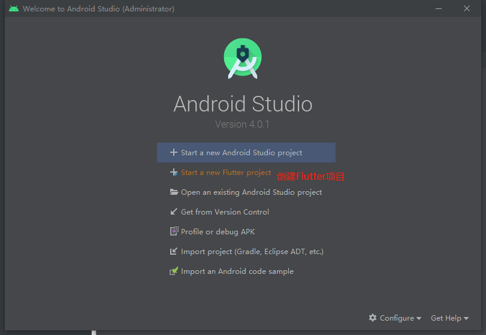
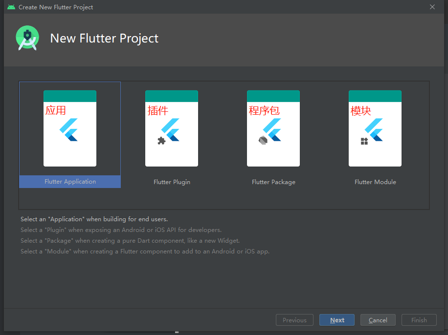
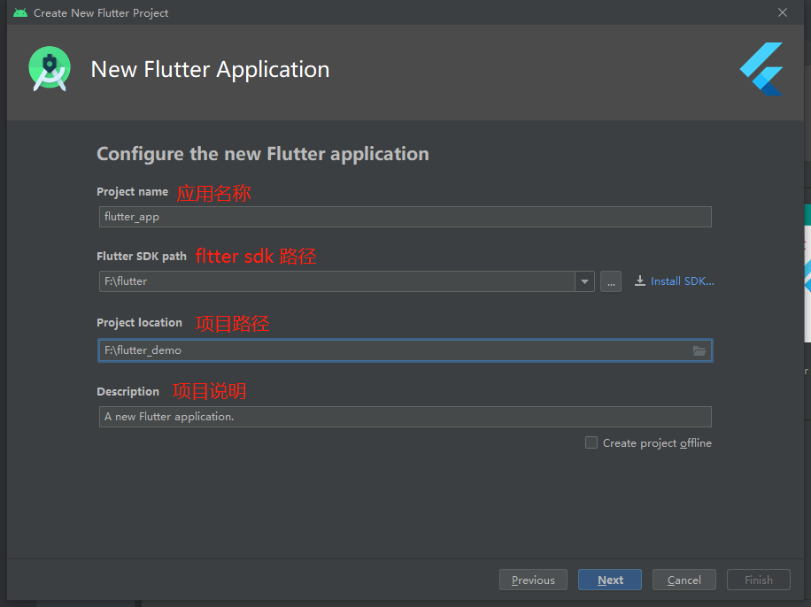

# Flutter 简介

Flutter是谷歌的移动UI框架，可以快速在iOS和Android上构建高质量的原生用户界面。 Flutter可以与现有的代码一起工作。在全世界，Flutter正在被越来越多的开发者和组织使用，并且Flutter是完全免费、开源的。

- **跨平台：**现在Flutter至少可以跨4种平台，甚至支持嵌入式开发。我们常用的有Linux、Android、IOS，甚至可以在谷歌最新的操作系统上Fuchsia进行运行,经过第三方扩展，甚至可以跑在MacOS和Windows上，到目前为止，Flutter算是支持平台最多的框架了，良好的跨平台性，直接带来的好处就是减少开发成本。
- **原生用户界面：** 它是原生的，让我们的体验更好，性能更好。用官方的话讲就是平滑而自然的滑动效果和平台感知，为您的用户带来全新的体验。

## 120fps超高性能

Flutter采用GPU渲染技术，所以性能极高。

Flutter编写的应用是可以达到120fps(每秒传输帧数),这也就是说，它完全可以胜任游戏的制作。而我们常说的RN的性能只能达到60fps，这也算是Flutter的一个超高竞争力吧。官方宣称Flutter甚至会超过原生性能。

## Flutter生态情况

由于有google这样的超级公司支持和推广，Flutter虽然刚出来没有多久，但是生态还是非常好的，中国也有了大量的Flutter爱好者。

插件由法国人总结了一个Flutter的插件列表，里边的插件非常丰富。

**github地址：**https://github.com/Solido/awesome-flutter

目前阿里集团已经开始使用Flutter来进行开发了，比如我们经常使用的闲鱼，主要模块就是Flutter进行开发的。再给大家一个图片，这些效果都是Flutter进行开发的。

# Flutter 基本使用

## 系统的基本要求

- **操作系统:**必须windows7以上64位操作系统。（这个一般都能很好的满足）
- **磁盘空间：**大于3个G，虽然官方说的是400M，但是你还需要安装Android Studio 和 虚拟机，所以至少要3个G左右，如果能达到5个G就更好了（满足多个虚拟机的要求）。
- **需要Git环境：**Flutter需要git环境的支持，所以这个也要有，作为一个前端，这个是必备工具，所以我在文章中就不教大家安装了。
- **需要JAVA环境：**https://www.oracle.com/technetwork/java/javase/downloads/jdk8-downloads-2133151.html

## 基本配置流程

~~~makefile
# 安装JAVA环境
JAVA下载地址: https://www.oracle.com/technetwork/java/javase/downloads/jdk8-downloads-2133151.html

#↓↓↓↓↓↓↓↓↓↓#

# 安装FlutterSDK包
FlutterSDK下载地址: https://flutter.io/sdk-archive/#windows

#↓↓↓↓↓↓↓↓↓↓#

# 将安装包解压到对应路径 (如： E:\fluter\flutter)

#↓↓↓↓↓↓↓↓↓↓#

# 国内环境配置环境变量
export PUB_HOSTED_URL=https://pub.flutter-io.cn
export FLUTTER_STORAGE_BASE_URL=https://storage.flutter-io.cn

#↓↓↓↓↓↓↓↓↓↓#

# 运行flutter命令
在Flutter安装目录的flutter文件下找到flutter_console.bat，双击运行并启动flutter命令行。

#↓↓↓↓↓↓↓↓↓↓#

# 配置环境变量
flutter/bin
~~~

## Flutter doctor 环境测试

终端中输入`flutter doctor`，会得到下面类似的结果。

~~~mathematica
Android toolchain - develop for Android devices
    • Android SDK at D:\Android\sdk
    ✗ Android SDK is missing command line tools; download from https://goo.gl/XxQghQ
    • Try re-installing or updating your Android SDK,
      visit https://flutter.io/setup/#android-setup for detailed instructions.
~~~

## Android Studio的安装

~~~makefile
# 下载并安装AndroidStudio
AndroidStudio下载地址: https://www.oracle.com/technetwork/java/javase/downloads/jdk8-downloads-2133151.html
# AndroidStuido安装插件
打开Android Stuido 软件，找到Plugin的配置，搜索Flutter插件。
点中间的Search in repositories点击安装。安装完成后，重新启动Android Studio软件。
~~~

## 安装Android证书

安装好Android Studio后，再次打开终端（命令行），输入`flutter doctor`,这时候的x会明显减少，但是还是会遇到1-2个，其中有一个就是提示没有安装证书。安装证书只要在终端里执行下面的命令。

~~~makefile
# 安装证书(一律选择Y, 就可以把证书安装好)
flutter doctor --android-licenses
~~~

## Flutter项目构建流程

## 构建问题解决

运行时会卡在Running ‘gradle assembleDebug, 因为Gradle的Maven仓库在国外, 可以使用阿里云的镜像地址。

具体参考：http://www.195440.com/2749

