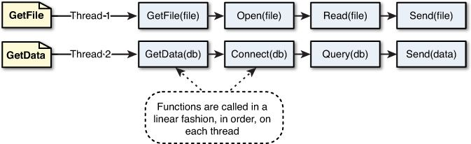

# Node 基础知识补充

## CMD基本知识

命令行窗口（小黑屏）、CMD窗口、终端、shell
`开始菜单 --> 运行 --> CMD --> 回车`
`Win + R --> CMD --> 回车`

| 命令      | 功能                     |
| --------- | ------------------------ |
| dir       | 列出当前目录下的所有文件 |
| cd 目录名 | 进入到指定的目录         |
| md 目录名 | 创建一个文件夹           |
| rd 目录名 | 删除一个文件夹           |

### 目录

`.`表示当前目录
`..`表示上一级目录

## 环境变量（window系统中的变量 ）

​	PATH ：`C:\Program Files\Microsoft SQL Server\130\Tools\Binn\`

当我们在命令行窗口打开一个文件，或调用一个程序时，系统会首先在当前目录下寻找文件程序，如果找到了则直接打开
如果没有找到则会依次到环境变量path的路径中寻找，直到找到为止如果没找到则报错类似于作用域链
所以我们可以将一些经常需要访问的程序和文件的路径添加到path中，这样我们就可以在任意位置来访问这些文件和程序了

## 进程和线程

**进程：** 进程负责为程序的运行提供必备的环境
进程就相当于工厂中的车间

**线程：** 线程是计算机中最小的计算单位，线程负责执行进程中的程序
线程就相当于工厂中的工人

**单线程：**JS是单线程，在执行JS代码的时候网页是停止渲染的。


**多线程：**主流的语言，如Java



# Node.js 概念

Node.js是一个能够在服务器端运行JavaScript的开放源代码、跨平台JavaScript运行环境。

Node采用Google开发的V8引擎运行js代码，使用事件驱动、非阻塞和异步I/O模型等技术来提高性能，可优化应用程序的传输量和规模。

 Node大部分基本模块都用JavaScript编写。在Node出现之前，JS通常作为客户端程序设计语言使用，以JS写出的程序常在用户的浏览器上运行。

目前，Node已被IBM、Microsoft、Yahoo!、Walmart、Groupon、SAP、 LinkedIn、Rakuten、PayPal、VoxerGoDaddy等企业采用。

Node主要用于编写像Web服务器一样的网络应用，这和PHP和Python是类似的。但是Node与其他语言最大的不同之处在于，PHP等语言是阻塞的而Node是非阻塞的。

Node是事件驱动的。开发者可以在不使用线程的情况下开发出一个能够承载高并发的服务器。其他服务器端语言难以开发高并发应用，而且即使开发出来，性能也不尽人意，Node正是在这个前提下被创造出来。

Node把JS的易学易用和Unix网络编程的强大结合到了一起。

Node.js允许通过JS和一系列模块来编写服务器端应用和网络相关的应用。

核心模块包括文件系统I/O、网络（HTTP、TCP、UDP、DNS、TLS/SSL等）、二进制数据流、加密算法、数据流等等。Node模块的API形式简单，降低了编程的复杂度。

使用框架可以加速开发。常用的框架有Express.js、Socket.IO和Connect等。Node.js的程序可以在Microsoft Windows、Linux、Unix、Mac OS X等服务器上运行。

Node.js也可以使用CoffeeScript、TypeScript、Dart语言，以及其他能够编译成JavaScript的语言编程。

## Node的用途

 • Web服务API，比如REST
 • 实时多人游戏
 • 后端的Web服务，例如跨域、服务器端的请求
 • 基于Web的应用
 • 多客户端的通信，如即时通信

## I/O (Input/Output)

 I/O操作指的是对磁盘的读写操作

## Node语言是JS模型

Node是对ES标准一个实现，Node也是一个JS引擎，通过Node可以使js代码在服务器端执行
Node仅仅对ES标准进行了实现，所以在Node中不包含DOM 和 BOM
Node编写都是单线程的服务器
Node处理请求时是单线程，但是在后台拥有一个I/O线程池

## Node中使用的内建对象

`String Number Boolean Math Date RegExp Function Object Array`
`BOM`，`DOM`不能使用，但是可以使用 `console` 也可以使用定时器`setTimeout() setInterval()`

## ECMAScript标准的缺陷

没有模块系统，标准库较少，没有标准接口，缺乏管理系统

# 模块化（require）

如果程序设计的规模达到了一定程度，则必须对其进行模块化。
模块化可以有多种形式，但至少应该提供能够将代码分割为多个源文件的机制。
CommonJS 的模块功能可以帮我们解决该问题。
CommonJS规范的提出，主要是为了弥补当前JavaScript没有模块化标准的缺陷。
CommonJS规范为JS指定了一个美好的愿景，希望JS能够在任何地方运行。
CommonJS对模块的定义十分简单： – 模块引用 – 模块定义 – 模块标识

## 模块标识

模块标识其实就是模块的名字，也就是传递给require()方法的参数，它必须是符合驼峰命名法的字符串，或者是以.、…开头的相对路径、或者绝对路径。
模块的定义十分简单，接口也十分简洁。每个模块具有独立的空间，它们互不干扰，在引用时也显得干净利落。

## 核心模块

由node引擎提供的模块，核心模块的标识就是，模块的名字，里面封装着内置方法
`var fs = require("fs");`

## 文件模块

由用户自己创建的模块，文件模块的标识就是文件的路径（绝对路径，相对路径）
相对路径使用.或..开头

## 模块定义

在运行环境中，提供了exports对象用于导出当前模块的方法或者变量，并且它是唯一的导出的出口。
在模块中还存在一个module对象，它代表模块自身，而exports是module的属性。
在Node中一个文件就是一个模块。

## 模块引用

在规范中，定义了require()方法，这个方法接手模块标识，以此将一个模块引入到当前运行环境中。
模块引用的示例代码：`require('模块').math`

## 模块实例

Node中虽然使用的是CommonJS规范，但是其自身也对规范做了一些取舍。
在Node中引入模块，需要经历3个步骤	`– 路径分析	– 文件定位	– 编译执行`
在Node中，模块分为三类：一类是底层由C++编写的内建模块，一类是Node提供的核心模块；还有一类是用户编写的模块，称为文件模块。

~~~javascript
// 扩展模块
var math = require("./math");
// 核心模块
var fs = require("fs");
console.log(math.add(123,456));
console.log(fs);
~~~

我们可以通过 exports 来向外部暴露变量和方法只需要将需要暴露给外部的变量或方法设置为exports的属性即可

~~~javascript
//向外部暴露属性或方法
exports.x = "我是02.module.js中的x";
exports.y = "我是y";
exports.fn = function () {};
~~~

# 全局对象（global）

在全局中创建的变量和函数都会作为global的属性和方法保存

**实际上模块中的代码都是包装在一个函数中执行的，并且在函数执行时，同时传递进了5个实参**

~~~javascript
// 当node在执行模块中的代码时，它会首先在代码的最顶部，添加如下代码
function (exports, require, module, __filename, __dirname) {
  exports = module.exports
  // ....
} // 在代码的最底部，添加}代码
~~~

- **exports：**该对象用来将变量或函数暴露到外部
- **require：**函数，用来引入外部的模块
- **module：**代表的是当前模块本身
-  **__filename：**当前模块的完整路径
  `C:\Users\lilichao\WebstormProjects\class0705\01.node\04.module.js`
- **__dirname：**当前模块所在文件夹的完整路径
  `当前模块所在文件夹的完整路径`

~~~javascript
console.log(global.a);
console.log(arguments.callee + "");//- 这个属性保存的是当前执行的函数对象
console.log(arguments.length);
console.log(exports);
console.log(module.exports == exports);
console.log(__dirname);
~~~

## exports 和 module.exports

通过exports只能使用.的方式来向外暴露内部变量
`exports.xxx = xxx`
而module.exports既可以通过.的形式，也可以直接赋值
`module.exports.xxx = xxxx`
`module.exports = {}`
这样有个好处，就是引入的时候可以直接使用返回的exports值，不用通过.xxx获取

~~~javascript
// 模块一定义
module.exports = {}
// 模块二引入
var demo = require("模块一"); //demo = {}
~~~

# 模块包（package）

CommonJS的包规范允许我们将一组相关的模块组合到一起，形成一组完整的工具。
CommonJS的包规范由包结构和包描述文件两个部分组成。

## 引入包和使用包

~~~javascript
var math = require('math')
console.log(math.add(123,456))
~~~

**包结构：** 组织包中的各种文件，实际上就是一个压缩文件，解压以后还原为目录。符合规范的目录，应该包含如下文件：
`– package.json 描述文件	– bin 可执行二进制文件	– lib js代码	– doc 文档	– test 单元测试`

**包描述文件：** 描述包的相关信息，用于表达非代码相关的信息，它是一个JSON格式的文件 – package.json，位于包的根目录下，是包的重要组成部分。
package.json中的字段：` name、description、version、keywords、maintainers、contributors、bugs、licenses、repositories、dependencies、homepage、os、cpu、engine、builtin、directories、implements、scripts、author、bin、main、devDependencies。`

[^注意]:在JSON文件不能写注释

# 缓冲区（Buffer）

从结构上看Buffer非常像一个数组，它的元素为16进制的两位数。一个元素就表示内存中的一个字节。
JS数组性能比其他语言的数组差，但Buffer中的内存不是通过JavaScript分配的，而是在底层通过C++申请的。也就是我们可以直接通过Buffer来创建内存中的空间。

- Buffer的结构和数组很像，操作的方法也和数组类似

- 数组中不能存储二进制的文件，而buffer就是专门用来存储二进制数据

- 使用buffer不需要引入模块，直接使用即可

- 在buffer中存储的都是二进制数据，但是在显示时都是以16进制的形式显示，buffer中每一个元素的范围是从
  00 - ff   0 - 255，00000000 - 11111111

  ~~~javascript
  // 计算机 一个0 或一个1 我们称为1位（bit）
  	8bit = 1byte（字节）
  	1024byte = 1kb
  	1024kb = 1mb
  	1024mb = 1gb
  	1024gb = 1tb
  ~~~

- buffer中的一个元素，占用内存的一个字节

- Buffer的大小一旦确定，则不能修改，Buffer实际上是对底层内存的直接操作

## BufferApi 方法

`Buffer.from(str) `将一个字符串转换为buffer
`Buffer.alloc(size)` 创建一个指定大小的Buffer
`Buffer.alloUnsafe(size) `创建一个指定大小的Buffer，但是可能包含敏感数据
 `buf.toString() `将缓冲区中的数据转换为字符串

## BufferApi实例

~~~javascript
var str = "Hello 尚硅谷";
//将一个字符串保存到buffer中
var buf = Buffer.from(str);
~~~

~~~javascript
//创建一个10个字节的buffer
var buf2 = Buffer.alloc(10);
//通过索引，来操作buf中的元素
buf2[0] = 88;
buf2[1] = 255;
buf2[2] = 0xaa;
buf2[3] = 256; //超过二进制8位就会舍掉前面多的
buf2[10] = 15; //一旦确定长度,不可修改
console.log(buf2) // <Buffer 58 ff aa 00 00 00 00 00 00 00>
//只要数字在控制台或页面中输出一定是10进制
console.log(buf2[2]) // 170
//转换为16进制的字符串 
console.log(buf2[2].toString(16) // aa
~~~

# 文件系统（fs）

在Node中，与文件系统的交互是非常重要的，服务器的本质就将本地的文件发送给远程的客户端。Node通过fs模块来和文件系统进行交互。该模块提供了一些标准文件访问API来打开、读取、写入文件，以及与其交互。要使用fs模块，首先需要对其进行加载。

~~~js
const fs = require("fs");
~~~

**同步和异步调用**

fs模块中所有的操作都有两种形式可供选择同步和异步。
同步文件系统会阻塞程序的执行，也就是除非操作完毕，否则不会向下执行代码。
异步文件系统不会阻塞程序的执行，而是在操作完成时，通过回调函数将结果返回。

## 打开&关闭文件

### 异步打开文件

`fs.open(path, flags[, mode], callback(fd))`
`fs.openSync(path, flags[, mode])`

### 同步关闭文件

`fs.close(fd, callback)`
`fs.closeSync(fd)`

- **path** - 文件的路径。
- **flags** - 文件打开的行为。具体值详见下文。
- **mode** - 设置文件模式(权限)，文件创建默认权限为 0666(可读，可写)。
- **callback** - 回调函数，带有两个参数如：callback(err, fd)。

### flags 参数列表

| Flag | 描述                                                   |
| ---- | ------------------------------------------------------ |
| r    | 以读取模式打开文件。如果文件不存在抛出异常。           |
| r+   | 以读写模式打开文件。如果文件不存在抛出异常。           |
| rs   | 以同步的方式读取文件。                                 |
| rs+  | 以同步的方式读取和写入文件。                           |
| w    | 以写入模式打开文件，如果文件不存在则创建。             |
| wx   | 类似 'w'，但是如果文件路径存在，则文件写入失败         |
| w+   | 以读写模式打开文件，如果文件不存在则创建。             |
| wx+  | 类似 'w+'， 但是如果文件路径存在，则文件读写失败。     |
| a    | 以追加模式打开文件，如果文件不存在则创建。             |
| ax   | 类似 'a'， 但是如果文件路径存在，则文件追加失败。      |
| a+   | 以读取追加模式打开文件，如果文件不存在则创建。         |
| ax+  | 类似 'a+'， 但是如果文件路径存在，则文件读取追加失败。 |

### open实例

~~~javascript
// 异步打开文件
console.log("准备打开文件！");
fs.open('input.txt', 'r+', function(err, fd) {if (!err) {
       console.log("文件打开成功！");     
}});
~~~

```
$ node file.js 
准备打开文件！
文件打开成功！
```

## 写入文件

fs中提供了四种不同的方式将数据写入文件
`– 简单文件写入	– 同步文件写入	– 异步文件写入	– 流式文件写入`

###  简单文件写入

 fs.writeFile(file, data[, options], callback)
  fs.writeFileSync(file, data[, options])

- **file ** - 文件的路径。
- **data ** - 被写入的内容，可以是String或Buffer。
- **options ** - 对象，包含属性（encoding、mode、flag）
- **callback** - 回调函数，带有两个参数如：callback(err, fd)。

 ~~~javascript
fs.writeFile('hello.txt','这是通过writeFile写入的内容',{flag:'w'},(err)=>{
	if(!err){console.log('写入成功~~~')}else{console.log('失败')}
})
 ~~~

### 同步文件写入

`fs.writeSync(fd, buffer, offset, length[, position])`
`fs.writeSync(fd, data[, position[, encoding]])`
要完成同步写入文件，先需要通过openSync()打开文件来获取一个文件描述符，然后在通过writeSync()写入文件。

- **fd ** - 文件描述符，通过openSync()获取
- **data ** - 被写入的内容，可以是String或Buffer。
- **offset** -  buffer写入的偏移量
- **length ** - 写入的长度
- **position ** - 写入的起始位置
- **encoding**  -  写入编码

~~~javascript
var fsTxt = fs.openSync('hello.txt','w');//打开文件
//文件编号为3
console.log(fsTxt)
//向文件中写入内容
fs.writeSync(fsTxt,'今天天气真不错~~~~',2,'utf-8');
//关闭文件
fs.closeSync(fsTxt)
~~~

### 异步文件写入

`fs.write(fd, buffer, offset, length[, position], callback)`
`fs.write(fd, data[, position[, encoding]], callback)`
要使用异步写入文件，先需要通过open()打开文件，然后在回调函数中通过write()写入。

- **fd ** - 文件描述符，通过openSync()获取
- **data ** - 被写入的内容，可以是String或Buffer。
- **offset** -  buffer写入的偏移量
- **length ** - 写入的长度
- **position ** - 写入的起始位置
- **encoding**  -  写入编码
- **callback**  -  回调函数

~~~javascript
//打开文件
var fd = fs.open('hello.txt','w',function(err,fd){if(!err){//判断是否出错
		//如果没有出错，则对文件进入写入
		fs.write(fd,'这是异步写入的内容',function(err){ //文件写入
			if(!err){console.log('写入成功')}
			fs.close(fd,function(){console.log('文件已关闭')})//关闭文件
			
		})
}else{console.log(err)}})//如果出错则弹出错误
~~~

### 流式文件写入

往一个文件中写入大量数据时，最好的方法之一是使用流。
若要将数据异步传送到文件，首需要使用以下语法创建一个Writable对象：
`fs.createWriteStream(path[, options])`

- **path **  -  文件路径
- **options**  -  对象，包含属性（encoding、mode、flag）

**一旦你打开了Writable文件流，就可以使用write()方法来写入它，写入完成后，在调用end()方法来      关闭流。**

~~~javascript
var ws = fs.createWriteStream('hello.txt') // 开启hello.txt的文件流
~~~

**可以通过监听流的open和close事件来监听流的打开和关闭**
`on(事件字符串,回调函数)	为对象绑定一个事件`
`once(事件字符串,回调函数)	为对象绑定一次性的事件`

~~~javascript
ws.once('open',()=>{console.log('流打开了~~~~')})
ws.once('close',()=>{console.log('流关闭了~~~~')})
~~~

**调用文件流write方法写入**

~~~javascript
ws.write('通过可写流写入文件的内容')
ws.write('今天天气真不错')
ws.write('锄禾日当午')
ws.write('红掌拨清清')
ws.write('清清真漂亮')
~~~

**调用文件流end方法关闭流**

~~~javascript
ws.end();
~~~

## 读取文件

 fs中提供了四种读取文件的方式
`– 简单文件读取    – 同步文件读取    – 异步文件读取    – 流式文件读取`

### 简单文件读取

`fs.readFile(file[, options], callback)`
`fs.readFileSync(file[, options])`

- **file ** - 文件的路径。
- **options ** - 对象，包含属性（encoding、mode、flag）
- **callback** - 回调函数，带有两个参数如：callback(err, fd)。

~~~javascript
fs.readFile('派大星.jpg',(err,data)=>{if(!err){ // 读取文件
	fs.writeFile('成了.jpg',data,(err)=>{console.log(!err ?'成功':'失败')})// 写入文件
}else{console.log('读取出错')}})
~~~


### 同步文件读取

• fs.readSync(fd, buffer, offset, length, position)

- **fd ** - 文件描述符，通过openSync()获取
- **buffer** -  读取文件的缓冲区
- **offset ** - buffer的开始写入的位置
- **length** - 要读取的字节数
- **position ** - 写入的起始位置

~~~javascript
fs.open('123.txt' , 'r' , function (err,fd){ // 读取文件
if(err){console.error(err);return;} 
 var buf = new Buffer(8);
 var readfile = fs.readSync(fd, buf, 0, 8, null); // 返回读取的字节数
})
~~~

### 异步文件读取

`fs.read(fd, buffer, offset, length, position, callback)`

- **fd ** - 文件描述符，通过openSync()获取
- **buffer** - 读取文件的缓冲区
- **offset** -  buffer写入的偏移量
- **length ** - 要读取的字节数
- **position ** - 开始读取文件的位置
- **callback**  -  回调函数 参数err , bytesRead , buffer

~~~javascript
fs.open('123.txt' , 'r' , function (err,fd){ // 读取文件
if(err){console.error(err);return;} 
 var buf = new Buffer(8);
 var readfile = fs.read(fd, buf, 0, 8, 0,(readfile)=>{
   console.log(readfile) // 返回读取的字节数
 }); 
})
~~~

### 流式文件读取

从一个文件中读取大量的数据时，最好的方法之一就是流式读取，这样将把一个文件作为Readable流  的形式打开。
要从异步从文件传输数据，首先需要通过以下语法创建一个Readable流对象：`fs.createReadStream(path[, options])`

- **path ** - 文件路径
- **options** - {encoding:"",mode:"",flag:""}

**当你打开Readable文件流以后，可以通过readable事件和read()请求，或通过data事件处理程序   轻松地从它读出。**

~~~javascript
var rs = fs.createReadStream('test.mp4')
var ws = fs.createWriteStream('HuoGuoP.mp4')
//监听流的开启和关闭
rs.once('open',()=>{console.log('读取流打开了~~~~')})
//数据读取完毕，关闭可写流
rs.once('close',()=>{console.log('读取流关闭了~~~~');ws.end()})
//如果要读取一个可读流中的数据，必须要为可读流绑定一个data事件
rs.on('data',(data)=>{ //data事件绑定完毕，它会自动开始读取数据
	ws.write(data) // 写入文件
})
~~~

**pipe()方法将可读流内容直接输出到可写流中，并且自动关闭**

~~~javascript
var rs = fs.createReadStream('test.mp4')
var ws = fs.createWriteStream('HuoGuoP.mp4')
rs.pipe(ws)
~~~

## 其他操作

~~~markdown
# 验证路径是否存在
	- fs.exists(path, callback)
	- fs.existsSync(path)
# 获取文件信息
	- fs.stat(path, callback)
	- fs.statSync(path)
# 删除文件
	- fs.unlink(path, callback)
	- fs.unlinkSync(path)
# 列出文件
	- fs.readdir(path[, options], callback)
	- fs.readdirSync(path[, options])
# 截断文件
	- fs.truncate(path, len, callback)
	- fs.truncateSync(path, len)
# 建立目录
	- fs.mkdir(path[, mode], callback)
	- fs.mkdirSync(path[, mode])
# 删除目录
	- fs.rmdir(path, callback)
	- fs.rmdirSync(path)
# 重命名文件/文件夹
	- fs.rename(oldPath, newPath, callback)
	- fs.renameSync(oldPath, newPath)
# 监视文件/文件夹更改写入
	- fs.watch(path, [, options], callback) => 性能较好
	- fs.watchFile(path, [, options], callback)
~~~

# 路径系统 (path)

`path` 模块提供了一些用于处理文件与目录的路径的实用工具。 

~~~markdown
# 提取文件扩展名
	- path.extname(path)
# 拼接路径字符串
	- path.join([...paths])
	- path.resolve([...paths])
# 解析路径完整信息
	- path.parse(path)
~~~

###### ###

# 操作系统 (os)

`os` 模块提供了与操作系统相关的实用方法和属性。 

~~~markdown
# 查看CPU架构
	- os.arch()
# CPU内核信息/状态
	- os.cpus()
# 系统内存总量
	- os.totalmem()
# 系统空闲内存量
	- os.freemem()
# 操作系统名称
	- os.type()
# 系统正常运行时间
	- os.uptime()
# 操作系统主机名
	- os.hostname()
~~~

###### ###

# 地址解析系统 (url)

~~~js
const URL_Info = new URL('https://translate.google.cn/?search=6#view=home');
console.log(URL_Info)
// ===>
URL {
  href: 'https://translate.google.cn/?#view=home/search=6', 	// 地址
  origin: 'https://translate.google.cn', 	// 根路径地址
  protocol: 'https:',		// 请求协议
  username: '',		// 邮箱用户名部分
  password: '',		// 邮箱密码部分
  host: 'translate.google.cn',	// URL主机部分(包含端口)
  hostname: 'translate.google.cn',		// URL主机部分(不包含端口)
  port: '',		// URL端口部分
  pathname: '/',	// URL路径部分
  search: '?search=6',	// URL查询字符串部分
  searchParams: URLSearchParams { 'search' => '6' },	// // URL查询字符串组成的对象
  hash: '#view=home'	// 田子码符串部分
}

const url = require('url')
url.parse('/search?title=helloWord')
// ===>
/search?title=helloWord Url {
  protocol: null,
  slashes: null,
  auth: null,
  host: null,
  port: null,
  hostname: null,
  hash: null,
  search: '?title=helloWord',
  query: 'title=helloWord',
  pathname: '/search',
  path: '/search?title=helloWord',
  href: '/search?title=helloWord'
}
~~~

###### ###

# 服务器系统 (http)

nodejs提供了http模块，自身就可以用来构建服务器，而且http模块是由C++实现的，性能可靠。

## 开启本地服务器的基本流程

~~~js
// 引入本地服务器API
const http = require('http')
// 创建服务器实例
const server = http.createServer()
// 绑定接收请求事件
server.on('request', (req, res)=>{
  // 请求路径 (请求路径永远以 "/" 开头)
  console.log(req.url)
  // 根据请求路径处理事件, 返回对应数据给用户
  res.end('hello world')
})

// 绑定监听端口号, 开启服务器
server.listen(3000, ()=> console.log('服务器开启成功, 端口号为:3000'))
~~~

## req (请求) 携带的常用参数

~~~js
const http = require('http')
const server = http.createServer()
server.on('request', (req, res) => {
    // 请求路径 (请求路径永远以 "/" 开头)
    console.log(req.url)
    // 请求头对象
    console.log(req.headers)
    // 请求类型
    console.log(req.method)

    res.end('hello world')
})
server.listen(3000, () => console.log('服务器开启成功, 端口号为:3000'))
~~~

## req (响应) 携带的常用参数

~~~js
const http = require('http')
const server = http.createServer()
server.on('request', (req, res) => {
    // 设置状态码和响应头
    res.writeHead(200, {'Content-Type':'text/plain'})
    // 设置响应头
    res.setHeader('Content-Type', 'text/plain')
    // 写入内容
    res.write(fileData)
    // 结束响应
    res.end('hello word')
})
server.listen(3000, () => console.log('服务器开启成功, 端口号为:3000'))
~~~

# 加密系统 (crypto)

`crypto` 模块提供了加密功能，实现了包括对 OpenSSL 的哈希、HMAC、加密、解密、签名、以及验证功能的一整套封装。`Hash` 类是用于创建数据加密哈希值的工具类。查看 crypto 模块支持的 hash 函数：`crypto.getHashes()`

~~~js
'RSA-MD4', 'RSA-MD5', 'RSA-MDC2', 'RSA-RIPEMD160',
'RSA-SHA1', 'RSA-SHA1-2', 'RSA-SHA224', 'RSA-SHA256',
'RSA-SHA384', 'RSA-SHA512', 'blake2b512', 'blake2s256',
'md4', 'md4WithRSAEncryption', 'md5', 'md5-sha1',
'md5WithRSAEncryption', 'mdc2', 'mdc2WithRSA', 'ripemd',
'ripemd160','ripemd160WithRSA','rmd160','sha1',
'sha1WithRSAEncryption','sha224','sha224WithRSAEncryption',
'sha256','sha256WithRSAEncryption','sha384','sha384WithRSAEncryption',
'sha512','sha512WithRSAEncryption','ssl3-md5','ssl3-sha1','whirlpool'
~~~

## hash 加密(SHA-256)

hash算法加密使用 `hash.update()` 方法将要计算的数据以流（stream）的方式写入，流输入结束后，使用 `hash.digest()` 方法计算数据的 hash 值解析为字符串。

~~~js
const crypto = require('crypto');
// 创建哈希函数 sha256
const hash = crypto.createHash('sha256'); 

// 输入流编码：utf8、ascii、binary（默认）
hash.update('some data to hash', 'utf8');
// 输出编码：hex、binary、base64
console.log(hash.digest('hex'));

// 输出
// 6a2da20943931e9834fc12cfe5bb47bbd9ae43489a30726962b576f4e3993e50
~~~

## PBKDF2 加密(sha256)

PBKDF2算法加密通过多次hash来对密码进行加密。原理是通过str(加密字符串)和salt(盐值)进行hash(哈希值加密)，然后将结果作为salt在与str进行hash，多次重复此过程，生成最终的密文。

PBKDF2 是 Node.js 的 **crypto** 模块原生支持的标准方法。

~~~js
// 同步函数示例 -->
const crypto = require('crypto')
// crypto.randomBytes() 方法生成 32 字节的随机数 - 这里作为盐值
const salt = crypto.randomBytes(32);
// 参数列表：(未加密字符串, 盐值, 迭代次数, 密钥长度, 摘要函数-hash加密)
const result = crypto.pbkdf2Sync(password, salt, 4096, 512, 'sha256');
~~~

## salt 盐值加密(md5)

盐值就是随机数值，用于在计算密码的哈希值时插入特定的字符串，加强数据的安全性，可以有效抵御诸如字典攻击、彩虹表攻击等密码攻击媒介。

**常见的 Hash 算法使用示例**

~~~js
const crypto = require('crypto');
const md5 = crypto.createHash('md5');
let str = '123456';
// 直接对密码原文进行 Hash
md5.update(str);
console.log(md5.digest('hex')); 
// 输出
// e10adc3949ba59abbe56e057f20f883e
// 可以通过 <https://www.cmd5.com/> 反向查询得到密码，不够安全。
~~~

**加“盐”的 Hash 算法**

~~~js
const crypto = require('crypto');
const md5 = crypto.createHash('md5');

// 生成强加密的伪随机数
const buf = crypto.randomBytes(32);
const salt = buf.toString('hex')

// 将密码拼接上任意长度的随机字符串后，再进行 Hash
let password = '123456';
md5.update(password+salt);
console.log(md5.digest('hex'));
// 输出
// a43bfb9f12b6f69ad9fcd4338a981efbed2569a
~~~

## Hmac 加密(sha1)

HMAC算法加密是将散列算法与一个密钥结合在一起，以阻止对签名完整性破坏，其实就是类似于上面的提到的md5密码中加盐道理是类似的。

~~~js
const crypto = require('crypto');
// 创建hmac_hash函数(算法, 密匙)
const hmac = crypto.createHmac('sha1', 'BDvDYUmfdykkBLgX');
// 对字符串进行hash加密
hmac.update('data to crypt');
// 解析hash为字符串格式
console.log(hmac.digest('hex')); 
// 输出
// a43bfb9f12b6f69ad9fcd4338a981efbed2569ae
~~~

## Cipher (加密) 和 Decipher (解密)

Cipher类用于加密数据，属于对称密钥加密，假设通信双方A、B，通讯方A使用key对明文进行加密传输，通讯方B接收到密文后，使用同样的key进行解密得到明文。Cipher加密算法字符串格式是 `算法-秘钥长度-模式` node.js支持的有以下

~~~js
'aes-128-cbc', 'aes-128-cbc-hmac-sha1', 'aes-128-cbc-hmac-sha256', 'aes-128-ccm', 'aes-128-cfb', 'aes-128-cfb1', 'aes-128-cfb8', 'aes-128-ctr', 'aes-128-ecb', 'aes-128-gcm', 'aes-128-ocb', 'aes-128-ofb', 'aes-128-xts', 'aes-192-cbc', 'aes-192-ccm', 'aes-192-cfb', 'aes-192-cfb1', 'aes-192-cfb8', 'aes-192-ctr', 'aes-192-ecb', 'aes-192-gcm', 'aes-192-ocb', 'aes-192-ofb', 'aes-256-cbc', 'aes-256-cbc-hmac-sha1', 'aes-256-cbc-hmac-sha256', 'aes-256-ccm', 'aes-256-cfb', 'aes-256-cfb1', 'aes-256-cfb8', 'aes-256-ctr', 'aes-256-ecb', 'aes-256-gcm', 'aes-256-ocb', 'aes-256-ofb', 'aes-256-xts', 'aes128', 'aes128-wrap', 'aes192', 'aes192-wrap', 'aes256', 'aes256-wrap', 'bf', 'bf-cbc', 'bf-cfb', 'bf-ecb', 'bf-ofb', 'blowfish', 'des', 'des-cbc','des-cfb', 'des-cfb1', 'des-cfb8', 'des-ecb', 'des3',... 39 more items
~~~

### 常见的加密基本概念

~~~markdown
## AES加密
高级加密标准（英语：Advanced Encryption Standard，缩写：AES），在密码学中又称Rijndael加密法，是美国联邦政府采用的一种区块加密标准。这个标准用来替代原先的DES，已经被多方分析且广为全世界所使用。经过五年的甄选流程，高级加密标准由美国国家标准与技术研究院（NIST）于2001年11月26日发布于FIPS PUB 197，并在2002年5月26日成为有效的标准。2006年，高级加密标准已然成为对称密钥加密中最流行的算法之一。

AES使用的秘钥长度可以128位、192位或256位，所以通常看到的加密算法：aes-128/196/256，表示的都是秘钥的位数。而最后的一段是AES的工作模式，最常用的工作模式是ECB、CBC、CFB和OFB四种。
  1. ECB（电子密码本模式：Electronic codebook）是最简单的块密码加密模式，加密前根据加密块大小（如AES为128位）分成若干块，之后将每块使用相同的密钥单独加密，解密同理。ECB模式由于每块数据的加密是独立的因此加密和解密都可以并行计算，ECB模式最大的缺点是相同的明文块会被加密成相同的密文块，这种方法在某些环境下不能提供严格的数据保密性。
  2. CBC模式对于每个待加密的密码块在加密前会先与前一个密码块的密文异或然后再用加密器加密。第一个明文块与一个叫初始化向量的数据块异或。CBC模式相比ECB有更高的保密性，但由于对每个数据块的加密依赖与前一个数据块的加密所以加密无法并行。与ECB一样在加密前需要对数据进行填充，不是很适合对流数据进行加密。
  3. 与ECB和CBC模式只能够加密块数据不同，CFB(密文反馈:Cipher feedback)能够将块密文（Block Cipher）转换为流密文（Stream Cipher）。
  4. OFB（输出反馈：Output feedback）是先用块加密器生成密钥流（Keystream），然后再将密钥流与明文流异或得到密文流，解密是先用块加密器生成密钥流，再将密钥流与密文流异或得到明文，由于异或操作的对称性所以加密和解密的流程是完全一样的。
  5. GCM可以提供对消息的加密和完整性校验，另外，它还可以提供附加消息的完整性校验。在实际应用场景中，有些信息是我们不需要保密，但信息的接收者需要确认它的真实性的，例如源IP，源端口，目的IP，IV，等等。因此，我们可以将这一部分作为附加消息加入到MAC值的计算当中。下图的Ek表示用对称秘钥k对输入做AES运算。最后，密文接收者会收到密文、IV（计数器CTR的初始值）、MAC值。
 
## DES加密
des对称加密，是一种比较传统的加密方式，其加密运算、解密运算使用的是同样的密钥，信息的发送者和信息的接收者在进行信息的传输与处理时，必须共同持有该密码（称为对称密码），是一种对称加密算法。

DES使用一个56位的密钥以及附加的8位奇偶校验位，产生最大64位的分组大小。所以正常我们给DES加密的时候都是传递56位秘钥即可。同样DES也有几种工作模式：DES、ECB、CBC，工作模式基本和上面的一致。
~~~

### AES-256-GCM 示例

~~~js
const crypto = require('crypto');

// 初始化参数
const text = 'Encryption Testing AES GCM mode'; // 要加密和解密的数据
const key = crypto.randomBytes(32); // 256 位的共享密钥
const iv = crypto.randomBytes(16); // 初始向量(加工密匙)，16 字节
const algorithm = 'aes-256-gcm'; // 加密算法和操作模式

// 加密
const cipher = crypto.createCipheriv(algorithm, key, iv); // 初始化加密算法
let encrypted = cipher.update(text, 'utf8', 'hex'); // 进行加密+
encrypted += cipher.final('hex'); // 加入剩余内容
const tag = cipher.getAuthTag(); // 生成标签，用于验证密文的来源

// 解密
const decipher = crypto.createDecipheriv(algorithm, key, iv); // 初始化解密算法
decipher.setAuthTag(tag); // 传入验证标签，验证密文的来源
let decrypted = decipher.update(encrypted, 'hex', 'utf8'); // 进行解密
decrypted += decipher.final('utf8'); // 加入剩余内容

console.log(decrypted); // Encryption Testing AES GCM mode
~~~

## 非对称加密 (REA密匙)

非对称加密算法需要两个密钥：公开密钥（publickey:简称公钥）和私有密钥（privatekey:简称私钥）。非对称密码体制的特点：算法强度复杂、安全性依赖于算法与密钥但是由于其算法复杂，而使得加密解密速度没有对称加密解密的速度快。对称密码体制中只有一种密钥，并且是非公开的，如果要解密就得让对方知道密钥。

### 生成 RSA 密匙对

~~~js
const { generateKeyPair, generateKeyPairSync } = require('crypto');
generateKeyPair('rsa', { // 算法名称 必须是 rsa / dsa / ec 之一
  modulusLength: 4096, // 密匙长度
  publicKeyEncoding: { // 公钥编码格式
    type: 'spki', // pkcs1、spki
    format: 'pem'
  },
  privateKeyEncoding: { // 私钥编码格式
    type: 'pkcs8', // 私钥输出格式 必须是 pkcs1 / pkcs8 / sec1 之一
    format: 'pem', // 私钥输出格式 必须是 pem / der 之一
    cipher: 'aes-256-cbc', // 对私钥使用 aes-256-cbc 算法加密后返回
    passphrase: 'top secret' // aes-256-cbc 算法密钥
  }
}, (err, publicKey, privateKey) => {
  // 创建文件保存密匙对....
});
// 同步方法
const { privateKey, publicKey } = crypto.generateKeyPairSync('ec', {/*...*/);
~~~

### 公钥加密 / 私钥解密

~~~js
const crypto = require('crypto');
const fs = require('fs');
// 读取密匙对
const publicKey = fs.readFileSync('/mypubkey.pem')
const privateKey = fs.readFileSync('/ mykey.pem')
// 需要加密的内容
const data = 'data to crypt';
// 公钥加密
const encryptData = crypto.publicEncrypt(publicKey, Buffer.from(data));
console.log('encode', encryptData);
// 私钥解密
const decryptData = crypto.privateDecrypt(privateKey, encryptData);
console.log('decode', decryptData.toString());
~~~

## Sign / Verify (签名与验证)

Sign签名存在目的是为了防止不法分子修改参数数据，进而攻击服务器，导致数据泄露或从中获得利益。例如：一个接口是用户把积分转帐给他的朋友，修改后，变为转帐到攻击者的帐户，这样，攻击者就能得到利益。

~~~js
// 引入REA密匙生成器, 创建签名函数, 验证签名函数
const { generateKeyPairSync, createSign, createVerify } = require('crypto')
// 生成REA密匙
const { publicKey, privateKey } = generateKeyPairSync('rsa', { modulusLength: 4096 })// 密匙长度4096
// 私钥生成签名
const sign = createSign('SHA256');
sign.update('签名内容');
const sign_buf = sign.sign(privateKey);
// 公钥验证签名
const verify = createVerify('SHA256');
verify.update('签名内容');
console.log(verify.verify(publicKey, sign_buf));
~~~

## DH 密钥交换

DH密钥交换是1976年由Diffie和Hellman共同发明的一种算法。使用这种算法，通信双方仅通过交换一些可以公开的信息就能够生成出共享的密码数字，而这一密码数字就可以被用作对称密码的密钥。IPsec中就使用了经过改良的DH密钥交换。

~~~js
const crypto = require('crypto');
// Generate(生成) Alice's keys...
// 创建客户端的DH实例, 素数长度为1024
const alice = crypto.createDiffieHellman(1024);
// 产生公/私钥对, Ya = a^Xa mod p
const aliceKey = alice.generateKeys();

// Generate(生成) Bob's keys...
// 创建客户端的DH实例, 采用跟客户端相同的素数
const bob = crypto.createDiffieHellman(alice.getPrime(), alice.getGenerator());
// 产生公/私钥对, Ya = a^Xa mod p
const bobKey = bob.generateKeys();

// 交换并生成密匙...
// 计算 Ka = Yb^Xa mod p
const aliceSecret = alice.computeSecret(bobKey);
// 计算 Kb = Ya^Xb mod p
const bobSecret = bob.computeSecret(aliceKey);

// 由于素数p是动态生成的，所以每次打印都不一样
// 但是 clientSecret === serverSecret
console.log(aliceSecret === bobSecret)
~~~

## ECDH 密钥交换

`ECDH` 类是创建椭圆曲线 Diffie-Hellman（Elliptic Curve Diffie-Hellman (ECDH)）键交换的实用工具。 `ECDH` 类的实例可以使用 `crypto.createECDH()` 方法。。

~~~js
const crypto = require('crypto');

// Generate(生成) Alice's keys...
const alice = crypto.createECDH('secp521r1');
const aliceKey = alice.generateKeys();

// Generate(生成) Bob's keys...
const bob = crypto.createECDH('secp521r1');
const bobKey = bob.generateKeys();

// 交换并生成密匙...
// 计算 Ka = Yb^Xa mod p
const aliceSecret = alice.computeSecret(bobKey);
// 计算 Kb = Ya^Xb mod p
const bobSecret = bob.computeSecret(aliceKey);

console.log(aliceSecret === bobSecret)
~~~

