## 项目介绍

该项目是使用vue, vue/cli@4, element-ui, koa等主体技术搭建的音乐浏览与上传应用

## 开发日志

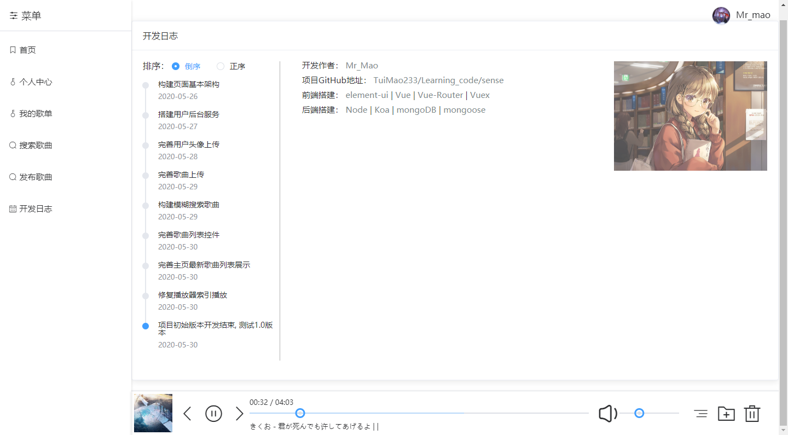

## 首页展示

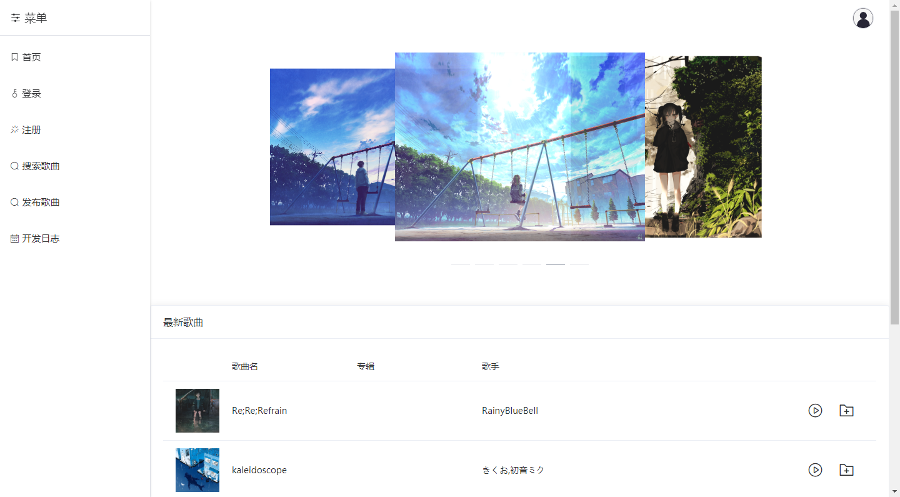

## 歌曲播放

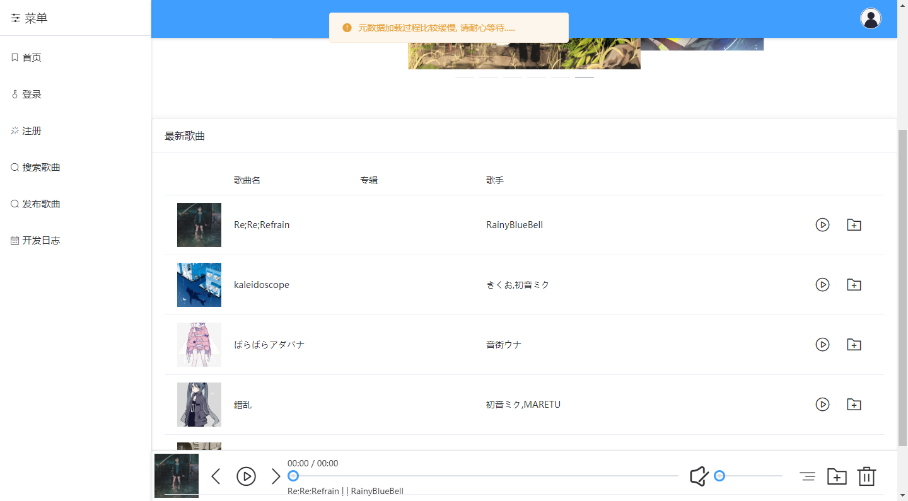

## 用户注册(上传头像)

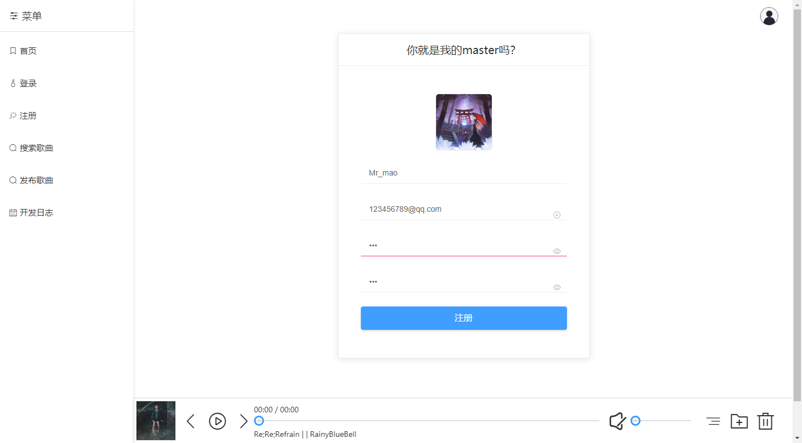

## 登录后页面展示(可修改头像)

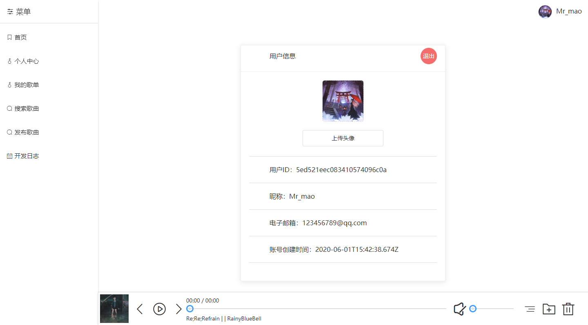

## 上传歌曲_浏览歌曲, 专辑图上传

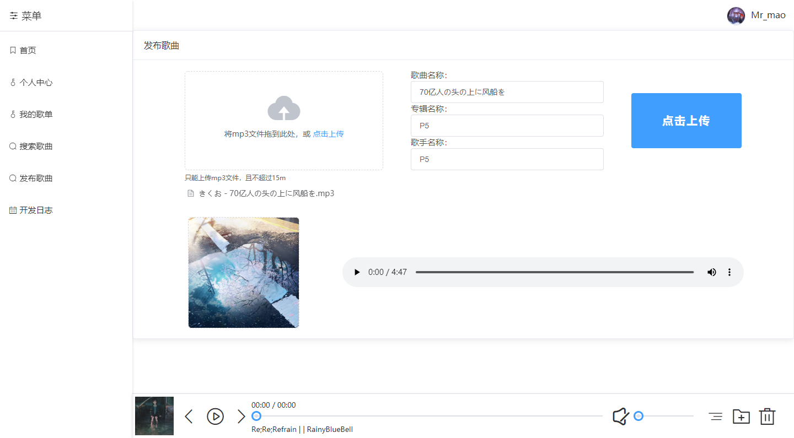

## 上传歌曲_文件判断

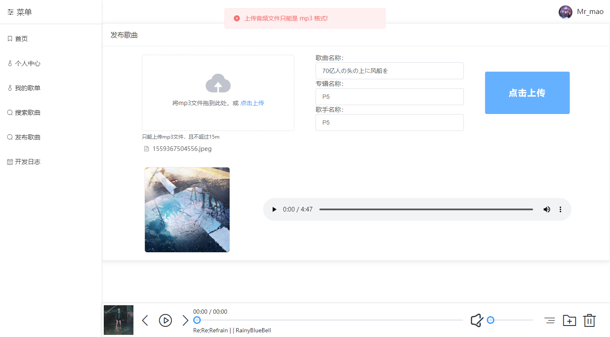

## 上传歌曲_加载页面

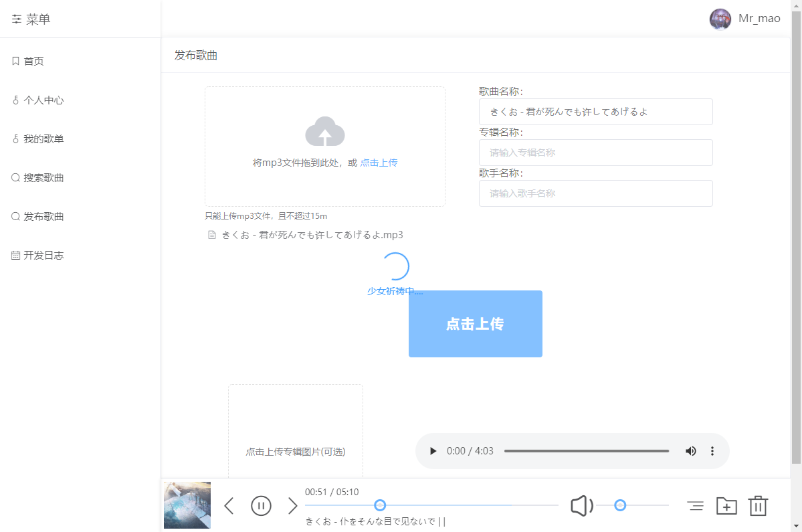

## 上传歌曲_成功提示

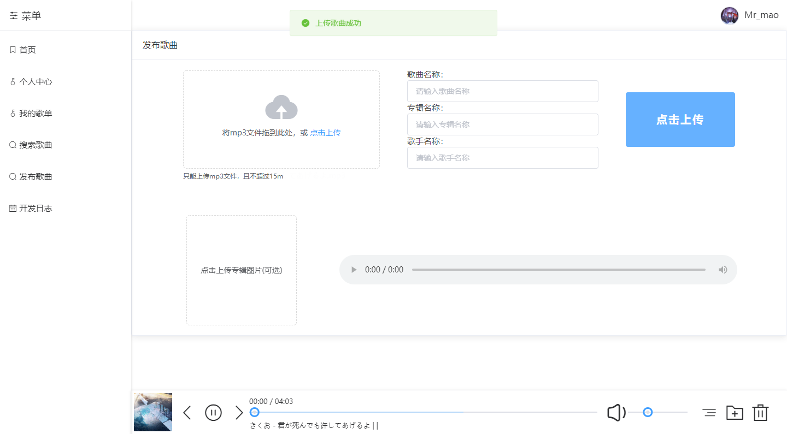

## 收藏歌曲_收藏成功

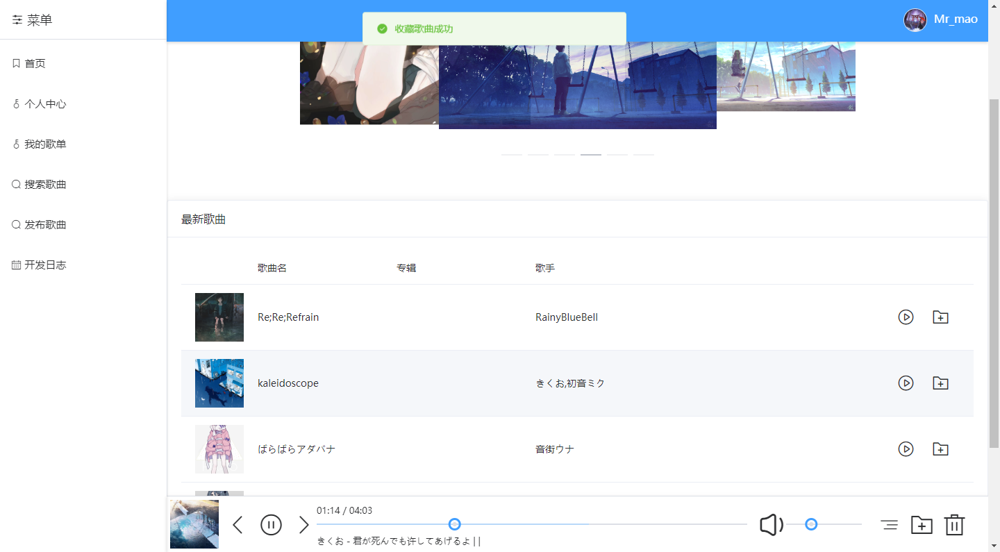

## 收藏歌曲_收藏失败

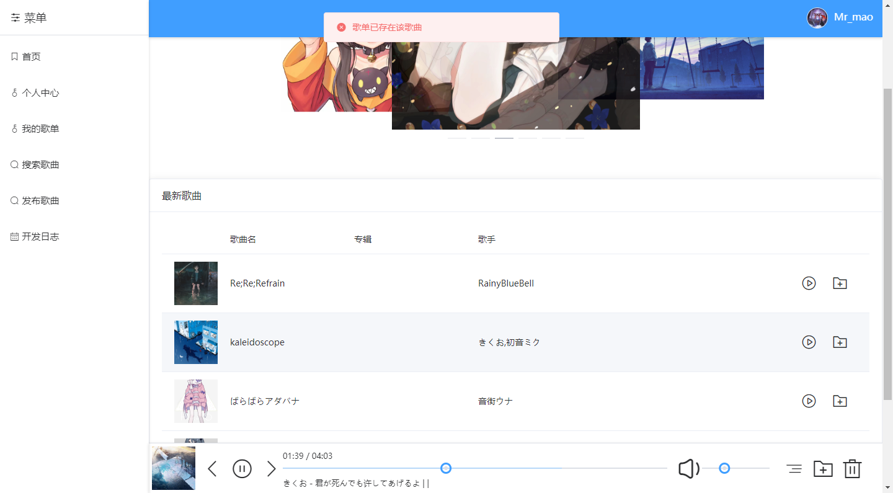

## 收藏歌曲_我的歌单

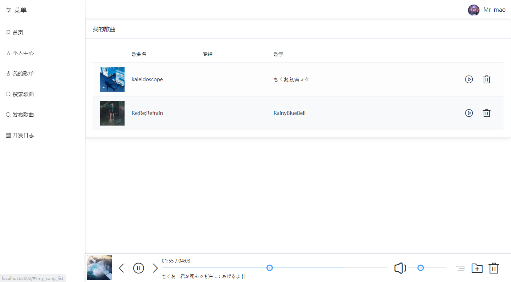

## 收藏歌曲_删除歌曲

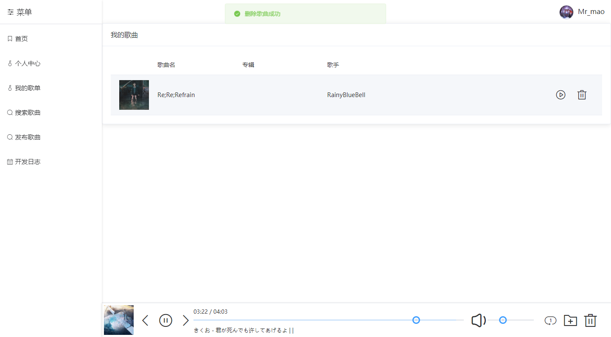