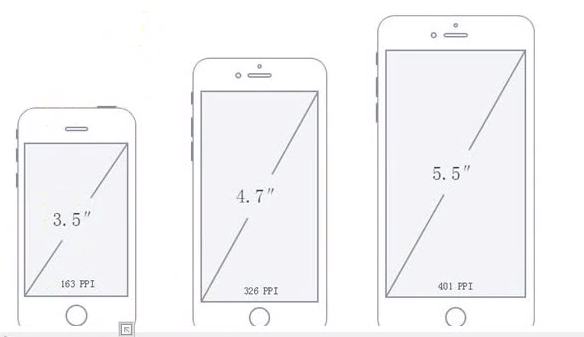

## Web App基本概念

### App 开发种类

#### Web App

WAP更侧重使用网页技术在移动端做展示，包括文字、媒体文件等。而Web App更侧重“功能”，是使用网页技术实现的App。总的来说，Web App就是运行于网络和标准浏览器上，基于网页技术开发实现特定功能的应用。

#### Native App

Native App是一种基于智能手机本地操作系统如iOS、Android、WP并使用原生程式编写运行的第三方应用程序，也叫本地app。一般使用的开发语言为JAVA、C++、Objective-C。

#### 混合 App

Hybrid App（混合模式移动应用）是指介于web-app、native-app这两者之间的app，兼具“Native App良好[用户](https://baike.baidu.com/item/用户/3621489)交互体验的优势”和“Web App跨平台开发的优势”。

### 移动端价值链

#### 网络运营商

中国移动，中国联通，中国电信

#### 设备供应商

华为、小米、魅族、oppo、vivo、联想、酷派、中兴、锤子、乐视、努比亚、海尔、格力、台湾省的htc、日本镇的索尼、韩国村的三星、苹果、黑莓、诺基亚、谷歌


### 移动端浏览器

移动端大概有30多种浏览器，其中20多种处于边缘化状态

#### 内置浏览器

内置浏览器更新慢，移植在操作系统。每部手机都有内置浏览器，这个浏览器属于设备的固件，通常由操作系统厂商开发。而且大多数内置浏览器都被精密的集成到了底层的操作系统中去了，换句话说，我们没有办法单独升级内置浏览器，只能借助于更新操作系统

安卓 ==> 安卓webkit

​	三星 三星webkit --> 三星 Chrome
​	中兴 中兴webkit --> 中兴 Chrome
​	华为 华为webkit --> 华为 Chrome
​	小米 小米webkit --> 小米 Chrome
​	索尼 索尼webkit --> 索尼 Chrome

ios ==> safari

#### 可下载浏览器

可下载浏览器更新快 独立于操作系统。在实践中，只有安卓才有可下载的浏览器，因为在ios上不允许安装其他的渲染引擎，而且没有厂商会为小的平台生产可下载浏览器

可下载浏览器QQ浏览器、UC浏览器。相比于内置浏览器有一个优势，就是只要有了版本更新就可以更新，在我们国内可下载浏览器是会占据一定移动端浏览器份额的，一个常见的原因就是这些浏览器提供了对当地社会更好的整合

#### webview 独立程序

webview是独立程序，是留给原生应用的一个操作系统浏览接口
	用了内置浏览器很多底层的组件(例如渲染引擎)

ios的操作系统默认不允许在它身上有多余的渲染引擎
	因此其他浏览器想在ios上运行就必须使用ios的webviewFe

#### 代理浏览器

渲染引擎存在于服务器，导致js性能及其底下，访问静态页面可以得到保障

代理浏览器的渲染引擎能够解析和执行HTMLCSs还有JavaScript，但并不是运行在设备上，而是在远程服务器上，与代理浏览器相对应的叫完备浏览器。
	1.用户请求一个页面,它不会发送一个普通的http请求,而是发送一个特殊的加密链接到一个特殊的代理服务器
	2.代理服务器会发送正常的http请求给用户希望访问的web服务器,代理服务器会请求相应的资源
	3.代理服务器包含一个渲染引擎,能够正常渲染页面
	4·代理服务器压缩页面,把它压缩成一种文件,这种文件类似于PDF,它有链接热点,用户也能简单的选择一些文本,或者稍微		放大缩小一下
	5·代理服务器同样通过加密链接把这个文件发到客户端、

#### 完备浏览器

它与我们预期的浏览器的运行方式一样，当用户请求一个页面时，浏览器就会通过http请求去抓取HTML CSS Javascript还有其他一些资源，一旦一切就绪，就会去渲染和显示页面。都是在客户端。

#### 混合浏览器

opera-mini	uc-mini

### 谷歌为何开发安卓

谷歌开发安卓系统的目的是增加用户对自己服务的使用量
		-->通过提供一个拥有自己的应用和搜索引擎的现代智能手机操作系统。
			谷歌诱使更多的人去使用自己的服务,从而获取更好的数据,因而获取更多的利润

在手机市场中分得了一块大肥肉
			-->当iPhone动摇移动世界的时候,大部分公司意识到他们需要一款与IOs匹敌的操作系统来保持自己在移动世界的				地位,一些亚洲厂商以及摩托罗拉很快就接受了谷歌的提议(诺基亚和黑莓认为自己能独立适应市场)

#### 差异化

设备厂商期望差异化,如果所有设备的操作系统都是一样的,那绝大多数消费者就不会关心他购买的是哪个品牌了为实现差异化厂商会对内置浏览器做响应的修改

谷歌不希望差异化,我们web开发者更不希望差异化,谷歌尝试将旧的安卓webkit浏览器转为Chrome
			->注意旧的安卓webkit并不是chrome,注意区分他们俩chrome在它的用户代理字符串中包含chrome这个单词谷歌服			务:而安卓webkit没有谷歌服务是一系列重要应用的集合,比如谷歌应用商店,谷歌地图等人安卓4.4开始他们可以独			立于安卓更新

## 移动端屏幕概念

### 屏幕尺寸

指屏幕的对角线的长度，单位是英尺，1英尺=2.54厘米
常见的屏幕尺寸有`2.4、2.8/3.5、3.7、、4.2、5.0、5.5、6.0`等



### 屏幕分辨率

**横纵向上物理像素的个数**。设备出厂时，该款设备所包含的物理像素的点数和一个物理像素所占据的实际屏幕尺寸是包含变的，是固定的

### 屏幕密度

**每英寸上物理像素的个数**，取决于屏幕是否是高清屏。

## 移动端像素(pixel)

桌面浏览器设计的网页中，css的1个像素往往都是对应着电脑屏幕的1个物理像素，在移动设备上，一个像素并不一定对应着设备的1个物理像素

### 物理像素


设备像素也被称为设备物理像素,他是显示设备中最微小的物理部件，**是设备呈像的最小单位**，也是屏幕分辨率。一个物理像素占据的实际屏幕尺寸在不同设备上是不一样的。

### CSS像素

CSS像素是一个抽象的单位,主要使用在浏览器上用来精确的度量(确定) web页面上的内容。它是为web开发者创造的，是在css或者javascript中使用的一个抽象的层，**是web开发中的最小单位**。一个css像素最终一定会转换为物理像素在屏幕中呈像。一个css像素占据多少个物理像素跟屏幕的特性(普通/高清屏 )，用户的缩放行为有关。

**例如：**一个width为200px的元素，它占据了200个css像素，但200个css像素占据多少个物理像素取决于屏幕的特性(是否是高密度,即像素比)和用户的缩放行为。例如在苹果的视网膜屏幕上，视网膜的像素密度是普通屏幕的两倍，这个元素就跨越了400个设备像素。如果用户放大，它将跨越更多的设备像素。css像素与物理像素的关系是靠浏览器厂商在维护，并不是设备厂商。css像表是浏览器中特有的概念

### 位图像素

一个位图像素**是图像最小的数据单元**。1个位图像素对应于1个物理像素，图片才能得到完美清晰的展示

### 设备独立像素

设备独立像素也是一个抽象的层，是**设备对接css像素的接口**。只有当浏览器厂商对接上设备独立像素时，浏览器厂商设计的移动端规则才能启作用，否则采取默认的规则。


### 物理&设备独立像素比

~~~
物理像素 / 设备独立像素 = 2 

一个方向上占据一块屏幕所需的物理像素个数 / 一个方向上占据一块屏幕所需的设备独立像素的个数

当写上meta标签后，width=device-width， 使css像素与设备独立像素链接了起来，即css像素等同于设备独立像素。也就是一个css像素，就是4个物理像素

由于物理像素，设备独立像素，像素比都是设备中的概念与浏览器没有-点关系，在设备出厂时这些参数就定了。所以在默认情况下，设备独立像素和像素比在web开发中亳无意义
为什么?
因为默认情况下，设备独立像素，物理像素比跟测览器没有一点关系，都是设备的东西。
~~~

## 视口尺寸(viewport)

**布局视口与视觉视口展示图**


### 布局视口(layuot viewport)

在移动端浏览器厂商面临着-个比较大的问题，他们如何将数以万计甚至可以说是数以亿计的pc端网页完整的呈现在移动端设备上，并且不会出现横向滚动条?

这个时候，视口的宽度还是和浏览器窗口的宽度一致?我们都 知道pc端网页-般 都为960px或者1024px，
那么要完整的放下它们，我们移动端测览器必须要有个容器放下它吧，而且只有有了这个容器我们才能很好的
见定移动端的浏览器到底能放下多大的页面(可能大于960页可能大于1024) 。这个数值最好大于960，而
且设备间的这个容器大小是没有太大差异的。**这个容器我们称为布局视口**，js获取布局视口：`document.documentElement.clientWidth | document.body.clientWidth`；

**浏览器的默认layuot viewport的宽度**


### 视觉视口(visual viewport)

用户正在看到的网页的区域。不管用户如何缩放，都不会影响到视觉视口的宽度，因为一个**视觉视口包含的物理像素的个数是确定的**（分辨率）js获取视觉视口：`window.innerWidth`；


### 理想视口(ideal viewport)

我们分析知道:布局视口的默认宽度并不是一个理想的宽度，对于我们移动设备来说，最理想的情况是

用户刚进入页面时不再需要缩放。这就是为什么苹果和其他效仿苹果的浏览器厂商会引进理想视口!
只有是专门为移动设备开发的网站，他才有理想视口这一说。而且只有当你在页面中加入viewport的meta标签，理想视口才会生效。js获取理想视口：`window.screen.width`；

~~~html
<meta name="viewport" content="width=device- width" />
						 <!--initial-scale=1.0
~~~

这一行代码告诉我们，布局视口的宽度应该与理想视口的宽度一致理想视口包含的css像素的个数等于独立设备像素的值
定义理想视口是浏览器厂商的工作，而不是设备或操作系统的工作。因此同一设备上的不同浏览器拥有不同的理想视口。但是浏览器理想视口大小取决于设备。同一款浏览器在不同设备上拥有不同的理想视口。

### 放大&缩小操作

**放大：**放大一个css像素的面积,视觉视口的尺寸变小，一个css像素包含的物理像素的个数变多

**缩小：**缩小一个css像素的面积,视觉视口的尺寸变大，一个css像素包含的物理像素的个数变少

### 视口尺寸标签(meta viewport)

meta viewport是专为移动设备下显示所设计的.只有检测到在移动设备上使用包含meta的文档时, meta标签才会起作用.

~~~html
<meta name="viewport" content="[Meta viewport]" />
~~~

- width：控制 viewport 的大小，可以指定的一个值，如 600，或者特殊的值，如 device-width 为设备的宽度（单位为缩放为 100% 时的 CSS 的像素）。
- height：和 width 相对应，指定高度。
- initial-scale：初始缩放比例，也即是当页面第一次 load 的时候缩放比例。
- maximum-scale：允许用户缩放到的最大比例。
- minimum-scale：允许用户缩放到的最小比例。
- user-scalable：用户是否可以手动缩放。

#### 完美视口

由于IOS不支持initial-scale属性，所以需要加上maximum-scale与minimum-scale=1，设置最大与最小比例都为1，则不能缩放

~~~html
<meta name="viewport" content="width=device-width,initial-scale=1.0,user-scalable=no,maximum-scale=1.0,minimum-scale=1.0">
<!--
css像素与设备独立像素关联起来,将视觉与视口比例设置为1,禁止用户缩放行为,最大缩放比例为1,最小缩放比例为1
-->
~~~

## 移动端适配

### css像素屏幕比例问题

**没有设置完美视口时：**每台手机css像素比例是相同的，css像素是按照布局视口的尺寸980/1024的比例。
**设置了完美视口时：**每个手机的css像素在不同设备上所占的物理像素是不一样的（像素比）比例取决于手机屏幕的特性（普通/高清屏）

### 利用rem进行适配

**优点：**没有破坏完美视口，**缺点：**px值到rem的转换太复杂

~~~css
/* em  自身标签font-size的大小 */
div{width: 10em;height: 10em;}
/* rem 根标签的font-size的大小 */
div{width: 10rem;height: 10rem;}
/* 谷歌下字体的默认大小为16px */
/* 谷歌下字体的最小大小为12px */
~~~

~~~html
<script>
var html = document.querySelector('html')
// 将html的字体大小更改为视觉视口大小的宽度, 这样, 1rem就等于满屏
html.style.fontSize = document.documentElement.clinetWidth + 'px'
// 假如我们要在总宽750px的div上放一个200px宽高的盒子，也就是750px = 1rem，那么就是200 / 750 ≈0.26rem

// 但是小数点并不方便计算，所以可以将满屏的宽度分成多个rem尺寸, 这里是16个rem等于满屏
html.style.fontSize = document.documentElement.clinetWidth / 16 + 'px'
// 假如我们要在总宽750px的div上放一个200px宽高的盒子，也就是750px = 16rem，那么就是(200 / 750) * 16 ≈ 4.26rem
</script>

<!-- 
设置了html的字体大小，但子元素有权重问题，一旦以某种方式更改了字体覆盖了html的字体大小，那么适配将不起效果，
所以要在适配标签中假如!important
-->
<script>
(function(){
    var styleNode = document.createElement("style");
	var w = document.documentElement.clientWidth/16;
	styleNode.innerHTML = "html{font-size:"+w+"px!important}";
	document.head.appendChild(styleNode);
})
</script>
~~~

#### 利用less简化计算rem

~~~less
@rem: 设计图总宽/16rem // 每一rem对应多少px
width: 70/@rem // css像素/rem值 = 则等于70对设计图总宽对应的rem值
~~~

### 利用viewport进行适配

**优点：**方便,直接使用px值也可以等比，**缺点：**没有使用完美视口

#### 将布局视口设置为设计图的宽度

问题：安卓不支持`width=number`

~~~html
<!-- 将布局视口设置为设计图的宽度 -->
<meta name="viewport" content="width=640">
<!-- 将布局视口设置为设计图的宽度 -->
~~~

#### 调整视口放大比例为设计图宽度

问题：`screen.width`兼容性太差

~~~html
<script>
    var targetW = 750
    // 视觉视口 / 设计图尺寸 = 一个视觉视口的px值 对应 一个设计图尺寸 的放大比例
    var scale = screen.width/targetW
    var meta = document.createElement('meta')
    meta.name = "viewport"
    meta.content = 'initial-scale='+scale+',maximum-scale='+scale+',minimum-scale='+scale+',user-scalable=no'
    document.head.appendChild(meta)
</script>
~~~

#### 根据完美视口调整放大比例

~~~html
<!-- 先设置为完美视口 -->
<meta name="viewport" content="width=device-width">
<script>
    var targetW = 750
    // 完美视口宽度 / 设计图宽度 = 一个视觉视口宽的px值 对应 一个设计图宽度 的放大比例
    var scale = document.documentElement.clientWidth / targetW
    var meta = document.createElement('meta')
    meta.name = "viewport"
    meta.content = 'initial-scale='+scale+',maximum-scale='+scale+',minimum-scale='+scale+',user-scalable=no'
    document.head.appendChild(meta)
</script>
~~~

## UIVew像素

UIVew:1px 在不同像素比中，对应的物理像素数量是不一样的，例如：像素比为2的手机上，1px对应2个物理像素，与之对应的像素比1的实际对比，像素比2的手机分栏线就会显得很粗。那这个时候在分栏线中，如何让1px值对应一个物理像素，这就显得很重要。

### 设置像素比缩放比例

~~~html
<div style="height:1px"></div>
<script>
(function(){
	//! 获取物理像素与设备独立像素比例
	var dpr  = window.devicePixelRatio||1;
	//! 在根据缩放比例 1 / 像素比 = 得到对应物理像素宽度比缩放比例的值
	var scale = 1/dpr;
	var meta = document.querySelector("meta[name='viewport']");
	meta.content="width=device-width,initial-scale="+scale;

	var styleNode = document.createElement("style");
	//! 设备独立像素(完美视口) * 物理像素与设备独立像素比例 = 物理像素宽度
	//! 那么调整了1px对应1个物理像素的缩放比例后，rem适配方案也要跟着发生改变 也就是16rem = 手机物理像素宽度
	var w = document.documentElement.clientWidth*dpr/16;
	styleNode.innerHTML="html{font-size:"+w+"px!important}";
	document.head.appendChild(styleNode);
})()
</script>

~~~

### 媒体查询像素比

~~~css
#test {height:1px}
@media only screen and (-webkit-device-pixel-ratio: 2){
    /* 像素比为2的时候，缩放指定元素 */
    #test{transform:scaleY(0.5)}
}
@media only screen and (-webkit-device-pixel-ratio: 3){
    /* 像素比为3的时候，缩放指定元素 */
    #test{transform:scaleY(0.3333333333333333333333333)}
}
~~~

## 移动端touch事件

### 手指按下(touchstart)

~~~js
item.addEventListener("touchstart",()=> console.log("touchstart"))
~~~

### 手指移动(touchmove)

~~~js
item.addEventListener("touchmove",()=> console.log("touchmove"))
~~~

### 手指松开(touchend)

~~~js
item.addEventListener("touchend",()=> console.log("touchend")))
~~~

### touchEvent 结构

~~~js
//changedTouches:触发当前事件的手指列表
//targetTouches:触发当前事件时元素上的手指列表
//touches:触发当前事件时屏幕上的手指列表
item.addEventListener("touchend",function(ev){
	ev = ev||event
	var item = document.querySelector(".item")
	console.log(ev.changedTouches)
    console.log(ev.targetTouches)
    console.log(ev.touches)
})
~~~

## 移动端常见事件

### 全面禁止默认行为

谷歌的手机模拟器与真机环境不同，手机模拟器不能禁止document的默认行为，但真机可以。

~~~js
document.addEventListener("touchstart",function(ev){
    ev = ev||event
    ev.prenentDefault()
})
~~~

#### 阻止事件无默认行为

当禁止所有默认行为时，如果有需要默认行为的元素，可以禁止元素的冒泡，避免受到父级元素的阻止所有默认行为的影响

~~~js
item.addEventListener("touchstart",function(ev){
    ev = ev||event
    ev.stopPropagation()
})
~~~

#### a标签跳转方案

当禁止所有默认行为时，解决a标签默认行为失效。

~~~js
var a = document.querySelectorAll('a')
for(var i=0; i<a.length; i++){
    
    //! 当a标签按下时,定义一个判断,代表鼠标还未滑动
    a.addEventListener('touchstart', function(){ this.isMoved = false })
    
    //! 当触发滑动时,更改判断,代表滑动了 
    a.addEventListener('touchmove', function(){ this.isMoved = true })
    
    //! 如果进行滑动了,那么不进行跳转.
    a.addEventListener('touchend', function(){ 
     	if(!this.isMoved){ location.href = this.href }
    })
    
}
~~~

### 防止点击事件误触

~~~js
naviMove.addEventListener('touchstart', function () {this.isMove = false})
naviMove.addEventListener('touchmove', function () {this.isMove = true})
naviMove.addEventListener('touchend',function (event) { 
    if(this.isMove){return} // 如果拖动了, end点击不执行
})
~~~

### 防止滑屏事件抖动

~~~js
touch: {
    start (ev) {
        // 保存按下X/Y偏移量
        this.startClientX = ev.touches[0].clientX
        this.startClientY = ev.touches[0].clientY
        // 抖动方向判断初始值
        this.isShakeX = false
        this.isShakeY = false
    },
    move (ev) {
        // 获取判断滑动值 
        this.slidingCountX = ev.touches[0].clientX - this.startClientX
        this.slidingCountY = ev.touches[0].clientY - this.startClientY

        //如果Y/X轴抖动，则直接返回 (防抖动)
        if (this.isShakeY) { return }
        if(this.isShakeY === this.isShakeX){
            // 一次性逻辑, 判断抖动方向
            this.isShakeX = Math.abs(this.slidingCountY) < Math.abs(this.slidingCountX)
            this.isShakeY = Math.abs(this.slidingCountY) > Math.abs(this.slidingCountX)
        }
    }
}
~~~

### 无缝滑屏轮播事件

~~~js
// 初始化代码
// 定义页码
// 定义一页的css像素是多少
// 定义一开始没有复制的项目长度
if(是否需要无缝){
    // 元素项目复制添加
    // 定义复制后的项目长度
}
function autoplaycreate () {
    // 执行无缝逻辑
    return setInterval(()=>{
        // 页码+1
        // 根据页码与一页宽度计算偏移量 , 在更新偏移量
        // 更新零件状态
    })
}
if (是否需要轮播){
    const timer = autoplaycreate()
}

touch: {
    start (ev) {
        // 如果有轮播, 按下时关闭轮播定时器
        
        // 记录滑屏值
        
        // 如果有无缝, 计算页码实现无缝
        // 假设有三张图片 [0 0 0] 有无缝为 [0 0 0  0 0 0]
        // 如果页码等于0,代表当前页为[1 0 0  0 0 0] 跳转为 [0 0 0  1 0 0]
        // 如果页码等于项目数量, 代表当前页为[0 0 0  0 0 1] 跳转为 [0 0 1  0 0 0]
        
        // 重置抖动判断
    },
    move (ev) {
        //如果Y轴抖动，则直接返回 (防抖动)
        
        // 计算滑屏值
        
        // 当滑屏值超出一页的css像素时固定为划过一页的值
        
        // 移动时改变元素transform值
    },
    end (ev) {
        //  如果有轮播  松开时启动轮播
        
        // 如果Y轴抖动, 不执行end逻辑
        
        // 松开时判断有没有超出滑屏值(是否进行上下切换)
        
        // 改变元素transfrom值为没切换的值(橡皮筋), 或者切换的值(换页)
    }
}
~~~

### 橡皮筋滑屏事件

~~~js
touch: {
    start (ev) {
        this.startClientX = ev['touches'][0].clientX
        this.startVaryElOffsetX = this.varyEl.getBoundingClientRect()['x']
    },
    move (ev) {
        // 计算滑屏值
        this.moveX = ev['touches'][0].clientX - this.startClientX + this.startVaryElOffsetX
        
        // 视口宽 / (视口宽 - 超出值) = 橡皮筋值 [1 , 0]之间
        // 拖动块总偏移量 + (超出值 * 橡皮筋值) = 橡皮筋滑动值(每次滑动有效距离减少)
        if(this.moveX > 0){ // 如果在左区间
			const leftEsxceedVal = (0 + this.moveX)
			this.rubberBandValue = this.viewWidth / ((this.viewWidth + this.moveX) * 3)
			this.moveX = 0 + leftEsxceedVal * this.rubberBandValue
        }
        if(this.moveX < -[moveTotalOffsetLeft]){ // 如果在右区间
			const rightEsxceedVal = -([moveTotalOffsetLeft] + this.moveX)
			this.rubberBandValue = this.viewWidth / ((this.viewWidth + this.moveX) * 3)
			this.moveX = -([moveTotalOffsetLeft] + (rightEsxceedVal * this.rubberBandValue))
        }
        this.varyEl.style.transform = `translateX(${this.moveX}px)`
    }
}
~~~

### 快速滑屏事件

~~~js
touch: {
    start (ev) {
        this.startClientX = ev['touches'][0].clientX
        this.startVaryElOffsetX = this.varyEl.getBoundingClientRect()['x']
        
        // 按下时,记录当前时间
        this.newTime = new Date().getTime()
        // 按下时, 重置当前拖动的像素
        this.slidingCount = 0
    },
    move (ev) {
        // 计算滑屏值
        this.moveX = ev['touches'][0].clientX - this.startClientX + this.startVaryElOffsetX
        // 记录滑动偏移量
	    this.slidingCount = this.moveClientX - this.startClientX
        this.varyEl.style.transform = `translateX(${this.moveX}px)`
    },
    end (ev) {
        this.lastTime = new Date().getTime() 
        // 计算时差(毫秒)
        const timeEqu = this.lastTime - this.newTime
        // 每毫秒走了多少css像素
        const speed = Math.abs(this.slidingCount / timeEqu)
        // 如果一毫秒的css像素超过0.6, 并且不在两侧区间, 则进行快速滑屏计算
        if (speed > 0.6 && this.moveX < 0 && this.moveX > -[moveTotalOffsetLeft]) {
            // 0.3总过渡时间 / 速度 = 当速度越快时, 时间越短
            this.varyEl.style.transition = 0.3 / speed +'s'
            // 计算快速滑屏距离(滑冰距离)
            this.moveX = this.moveX + speed * this.slidingCount
            // 锁定快速滑屏距离在 [移动到开头的距离, -移动到最后面的距离] 之间
            this.moveX = this.moveX > 0 ? 0 :
            			this.moveX < -[moveTotalOffsetLeft] ? -[moveTotalOffsetLeft] :
            			this.moveX
            this.varyEl.style.transform = `translateX(${this.moveX}px)`
        }
    }
}
~~~

## 移动端常见问题

### 禁止电话与邮箱高亮

在移动端中，出现类似电话和邮箱的字符串会高亮显示并可以进行相应的操作。在开发中，有时候并不需要这种功能。这时候可以在`meta`标签中禁止

~~~html
<!-- 禁止所有类似电话和邮箱的数字串的高亮点击 -->
<meta name="format-detection" content="telephone=no,email=no"/>
~~~

如果有特定字符串需要该功能，可以用a标签的href标签属性写上tel与mailto

~~~html
<p>1383838438</p>
<!-- a标签href可以带tel:手机号码 -->
<a href="tel:110">1383838438</a>
<!-- a标签href可以带tel:邮箱 -->
<a href="mailto:13888@qq.com">1383838438</a>
~~~

### 禁止点击链接高亮背景色

在移动端中，我们可能并不需要点击链接后高亮字体背景

~~~css
a {
	test-decoration: none;
	/* 禁止点击链接高亮背景 */
	-webkit-tap-highlight-color: rgba(0,0,0,0);
}
~~~

### 解决按钮默认圆角过圆

移动端的按钮默认样式是这样，这样太tm神奇了，我们想要的是正方形。我们需要禁止掉移动端默认的按钮圆角

~~~css
button { webkit-appearance:none }
~~~

### 解决浏览器自动调整字体大小

在浏览器中，如果浏览器觉得字体太小了，会自动的调整字体的大小。这个行为被称为`Font Boosting`。
`Font Boosting` 仅在未限定尺寸的文本流中有效，给元素指定宽高，就可以避免 `Font Boosting` 被触发。但是文本内容不可能都指定宽高。不过还好，可以指定 `max-height` 就可以无副作用的禁掉 `Font Boosting` 特性。

~~~css
p {font-size: 24px;;max-height: 999999px;}
~~~

## 移动端滚动方案

### 移动webApp滚动

在移动端如果使用局部滚动，意思就是我们的滚动在一个固定宽高的div内触发，将该div设置成overflow:scroll/auto;来形成div内部的滚动，这时我们监听div的onscroll发现触发的时机区分android和ios两种情况，具体可以看下面表格:

|    机型(内核)     |   body滚动   |   局部滚动   |
| :---------------: | :----------: | :----------: |
|        ios        | 不能实时触发 | 不能实时触发 |
|      android      |   实时触发   |   实时触发   |
| ios wkwebview内核 |   实时触发   |   实时触发   |

不能实时触发表现：只在手指触摸的屏幕上一直滑动时和滚动停止的那一刻才触发。

### 关于模拟滚动

正常的滚动：我们平时使用的scroll，包括上面讲的滚动都属于正常滚动，利用浏览器自身提供的滚动条来实现滚动，底层是由浏览器内核控制。

模拟滚动：最典型的例子就是iscroll了，原理一般有两种：

- 监听滚动元素的touchmove事件，当事件触发时修改元素的transform属性来实现元素的位移，让手指离开时触发touchend事件，然后采用requestanimationframe来在一个线型函数下不断的修改元素的transform来实现手指离开时的一段惯性滚动距离。
- 监听滚动元素的touchmove事件，当事件触发时修改元素的transform属性来实现元素的位移，让手指离开时触发touchend事件，然后给元素一个css的animation，并设置好duration和function来实现手指离开时的一段惯性距离。

#### 方案比较

第一种方案由于惯性滚动的时机时由js自己控制所以可以拿到滚动触发阶段的scrolltop值，并且滚动的回调函数onscroll在滚动的阶段都会触发。第二种方案相比第一种要劣势一些，区别在于手指离开时，采用的时css的animation来实现惯性滚动，所以无法直接触发惯性滚动过程中的onscroll事件，只有在animation结束时才可以借助animationend来获取到事件，当然也有一种方法可以实时获取滚动事件，也是借助于requestanimationframe来不断的去读取滚动元素的transform来拿到scrolltop同时触发onscroll回调。

#### 正常滚动和模拟滚动的性能比较

模拟滚动的fps值波动较大，这样滚动起来会有明显的卡顿感觉，各位体验的时候如果滚动超过10屏之后就可以明显感觉到两着的区别。

在使用模拟滚动时，浏览器在js层面会消耗更多的性能去改变dom元素的位置，在dom复杂层级深的页面更为高，所以在长列表滚动时还要使用正常滚动更好。

### 滚动和下拉刷新

方案1：借助iscroll的原理，整个页面使用模拟滚动，将下拉刷新元素放在顶部，当页面滚动到顶部下拉时，下拉刷新元素随着页面的滚动出现，当手指离开时收回，此方案实现起来较为简单直接借助iscoll即可，但是使用了模拟滚动之后在正常的列表滚动时性能上不如正常滚动。

方案2：页面使用正常滚动，将下拉刷新元素放置在顶部top值为负值(正常情况下不可见)，当页面处于顶部时下拉，这时监听touchmove事件，修改scrollcontent的tranlateY值，同时修改下拉刷新元素的tranlateY值，将两者同时位移来将下拉刷新元素显示出来，手指离开时(touchend)收回，这种方案满足了在正常列表滚动时使用原生的滚动节省性能，只在下拉刷新时使用模拟滚动来实现效果。

方案3：方案2的改良版，唯一不同是将下拉刷新元素和scrollcontent放在一个div里，将下拉刷新元素的margintop设为负值，在下拉刷新时，只需要修改scrollcontent一个元素的tranlateY值即可实现下拉，在性能上要比方案2好。

还会有一个性能上的问题就是：当页面的列表过长，dom元素过多时，在模拟滚动，下拉刷新这段时间内，页面也会有卡顿现象，这里采取了一个优化策略即：

- 列表较长时dom数量较多时，在触发下拉刷新的时机时将页面视窗之外的dom元素隐藏或者存放在fragment里面。
- 在刷新完成之后手指离开(touchend)时将隐藏的元素显示出来。
- 需要注意的是，隐藏和显示视窗外的元素这个操作在下拉刷新时只会执行一次，并且只有在下拉刷新时才会执行。

## 移动端滚动优化处理

### 防抖(Debouncing) or 节流(Throttling)

scroll 事件本身会触发页面的重新渲染，同时 scroll 事件的 handler 又会被高频度的触发, 因此事件的 handler 内部不应该有复杂操作，例如 DOM 操作就不应该放在事件处理中。 特别是针对此类高频度触发事件问题(例如页面 scroll ，屏幕 resize，监听用户输入等)。

### 防抖(Debouncing)

防抖技术即是可以把多个顺序地调用合并成一次，也就是在一定时间内，规定事件被触发的次数。

### 节流(Throttling)

防抖函数确实不错，但是也存在问题，譬如图片的懒加载，我希望在下滑过程中图片不断的被加载出来，而不是只有当我停止下滑时候，图片才被加载出来。又或者下滑时候的数据的 ajax 请求加载也是同理。这个时候，我们希望即使页面在不断被滚动，但是滚动 handler 也可以以一定的频率被触发(譬如 250ms 触发一次)，这类场景，就要用到另一种技巧，称为节流函数(throttling)。

节流函数，只允许一个函数在 X 毫秒内执行一次。

与防抖相比，节流函数最主要的不同在于它保证在 X 毫秒内至少执行一次我们希望触发的事件 handler。

关于[防抖动与节流](https://link.juejin.im/?target=http%3A%2F%2Fblog.zhangbing.club%2FJavascript%2F%E9%98%B2%E6%8A%96%E5%8A%A8%E4%B8%8E%E8%8A%82%E6%B5%81%2F)，我的博客文章也有提及。

### rAF触发滚动事件

如果页面只需要兼容高版本浏览器或应用在移动端，又或者页面需要追求高精度的效果，那么可以使用浏览器的原生方法 rAF(requestAnimationFrame)。

window.requestAnimationFrame() 这个方法是用来在页面重绘之前，通知浏览器调用一个指定的函数。这个方法接受一个函数为参，该函数会在重绘前调用。

rAF 常用于 web 动画的制作，用于准确控制页面的帧刷新渲染，让动画效果更加流畅，当然它的作用不仅仅局限于动画制作，我们可以利用它的特性将它视为一个定时器。(当然它不是定时器)

通常来说，rAF 被调用的频率是每秒 60 次，也就是 1000/60 ，触发频率大概是 16.7ms 。(当执行复杂操作时，当它发现无法维持 60fps 的频率时，它会把频率降低到 30fps 来保持帧数的稳定。)

```js
var ticking = false; // rAF 触发锁
function onScroll(){
  if(!ticking) {
    requestAnimationFrame(realFunc);
    ticking = true;
  }
}
function realFunc(){
	// do something...
	console.log("Success");
	ticking = false;
}
// 滚动事件监听
window.addEventListener('scroll', onScroll, false);
```

实现以16.7ms 触发一次 handler，降低了可控性，但是提升了性能和精确度。

**从本质上而言，我们应该尽量去精简 scroll 事件的 handler ，将一些变量的初始化、不依赖于滚动位置变化的计算等都应当在 scroll 事件外提前就绪。**

### 避免 scroll 事件中修改样式属性

输入事件处理函数，比如 scroll / touch 事件的处理，都会在 requestAnimationFrame 之前被调用执行。

因此，如果你在 scroll 事件的处理函数中做了修改样式属性的操作，那么这些操作会被浏览器暂存起来。然后在调用 requestAnimationFrame 的时候，如果你在一开始做了读取样式属性的操作，那么这将会导致触发浏览器的强制同步布局。

### 滑动中尝试禁止鼠标事件

pointer-events 是一个 CSS 属性，可以有多个不同的值,大概的意思就是禁止鼠标行为，应用了该属性后，譬如鼠标点击，hover 等功能都将失效，即是元素不会成为鼠标事件的 target。

pointer-events: none 可用来提高滚动时的帧频。的确，当滚动时，鼠标悬停在某些元素上，则触发其上的 hover 效果，然而这些影响通常不被用户注意，并多半导致滚动出现问题。对 body 元素应用 pointer-events: none ，禁用了包括 hover 在内的鼠标事件，从而提高滚动性能。

大概的做法就是在页面滚动的时候, 给 添加上 .disable-hover 样式，那么在滚动停止之前, 所有鼠标事件都将被禁止。当滚动结束之后，再移除该属性。

```js
// css 代码
.disable-hover,
.disable-hover * {
  pointer-events: none !important;
}
// js 代码
let body = document.body, timer;
window.addEventListener('scroll', function() {
	clearTimeout(timer);
	if(!body.classList.contains('disable-hover')) {
		body.classList.add('disable-hover')
	}
	timer = setTimeout(()=>{
		body.classList.remove('disable-hover')
	},500);
}, false);
```