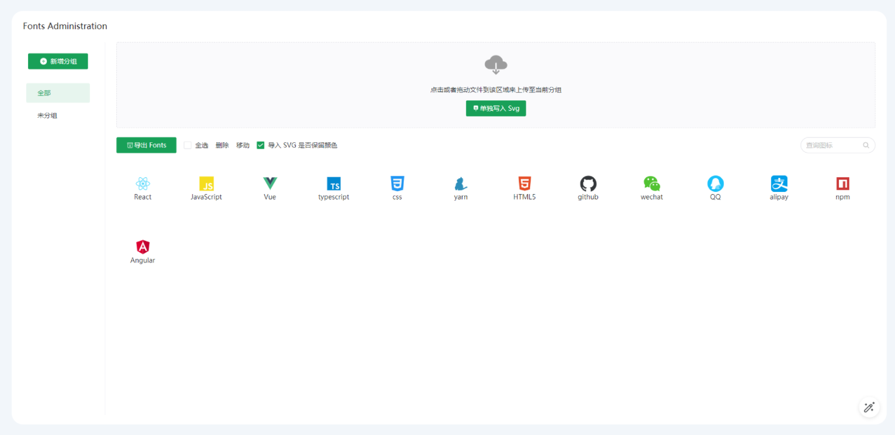

通过 [iconfont](http://iconfont.cn/) 或者 [icomoon](https://icomoon.io/) 来管理图标，生成字体，导入项目是目前比较常见的做法。

~~~
iconfont|icomoon -> import font|created font -> download -> Projects[use font]
~~~

1. 图标将放到平台中维护，下载字体文件到项目中使用，这样团队维护生成字体成本将非常高。
2. 小程序端需要通过 [transfonter](https://transfonter.org/) 转换，多端共用图标团队维护字体成本高，难以分组和合并使用。
3. 网页和小程序端共用的情况，需要管理多套字体引入。

基于上述难题，以及项目需求，使用了新的方案管理图标：[ViteFontAdmin](https://github.com/TuiMao233/vite-plugin-fonts-admin)

使用文档：[https://github.com/TuiMao233/vite-plugin-fonts-admin](https://github.com/TuiMao233/vite-plugin-fonts-admin)

1. 使用 ViteFontAdmin 导入设计图(Figma) Svg | 图标网站 Svg 文件
2. 自动生成，或者导出图标配置 | css 入口文件 | 字体文件 | base64
3. 假设在小程序使用，直接使用导出的 base64 入口即可

