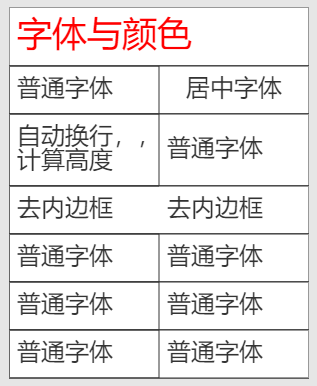

# 表单绘制扩展

## 基本使用流程

~~~html
<template>
  

    <image :src="imgUrl" style="width: 100px; height: 100px" />
    <!-- #ifdef MP-WEIXIN -->
    <canvas id="canvas" type="2d" :style="{height: height}" style="width: 750px;" />
    <!-- #endif -->
    <!-- #ifndef MP-WEIXIN -->
    <canvas canvas-id="canvas" :style="{height: height}" id="canvas" style="width: 300px;"/>
    <!-- #endif -->
  

</template>

~~~

## 设置表单配置

`dp.setFromOptions(FromOpts)`

表单绘制配置器, 用于配置单元格内边距, 表单外边距, 表单高度, 以下为可配置项

~~~js
interface FromOpts {
  // 初始化单元格内边距 dp.from.padding = 15
  padding?: number
  // 初始化表单外边距 dp.from.margin = 8
  margin?: number
  // 初始化表单高度 dp.from.height = 0
  height?: number
}
~~~

## 绘制层

`dp.createLayer(BaseOpts, RowOpts[])`

用于创建一行表单项, 自动计算行高边距, 调用自动累加 `dp.from.height`，`BaseOpts` 为当前行配置, `RowOpts[]` 为存放着多个列信息的数组, 以下为行可配置项

~~~js
interface BaseOpts {
  // 当前行背景色 默认 "#fff"
  background?: string,
  // 当前行 Y 轴偏移量, 默认 dp.from.height || dp.from.margin
  columnY?: number,
  // 当前行是否开启自适应栅格宽度, 默认 true
  self?: boolean,
  // 当前行是否开启内边框显示, 默认 true
  line?: boolean,
  // 当前行高度, 默认当前字体行高
  lineHeight?: number,
  // 当前行是否开启外边框显示, 默认 true
  border?: boolean,
}
~~~

以下为列配置项

~~~js
interface BaseOpts {
  // 当前列文字
  text: string,
  // 当前列文字样式, 默认 "24px sans-serif"
  font?: string,
  // 当前列文字颜色, 默认 "#333"
  color?: string,
  // 当前列文字是否居中, 默认 false
  center?: boolean,
  // 当前列自定义宽度, 只有 self 为 false 才起效果
  width?: number,
}
~~~